--------------------
# Spring JPA 공부 노트
--------------------

# 목차

- [1. 관계형 데이터베이스와 자바](#관계형-데이터베이스와-자바)
- [2. DB관리 Dokcer 생성](#DB관리-Dokcer-생성)
- [3. DB 연결](#DB-연결)
    - [3-1. SQL 사용](#SQL-사용)
- [4. ORM Object-Relation Mapping](#ORM-Object-Relation-Mapping)
- [5. ORM : 패러다임 불일치](#ORM-패러다임-불일치)
- [6. JPA 프로그래밍 프로젝트 셋팅](#JPA-프로그래밍-프로젝트-셋팅)
    - [6-1. 자동 설정 HibemateJpaAutoConfiguration](#자동-설정-HibemateJpaAutoConfiguration)
- [7. Domain 생성](#Domain-생성)
    - [7-1. JPA 데이터 영속화](#JPA-데이터-영속화)
    - [7-2. hibernate 영속화](#hibernate-영속화)
- [8. JPA 엔티티 맵핑](#JPA-엔티티-맵핑)
    - [8-1. 어노테이션 정보](#어노테이션-정보)
- [9. JPA Value 타입 맵핑](#JPA-Value-타입-맵핑)
- [10. JPA 1대다 맵핑](#JPA-1대다-맵핑)
    - [10-1. 단방향 @ManyToOne Study 가 주인](#단방향-@ManyToOne-Study-가-주인) 
    - [10-2. 단방향 @OneToMany Account 가 주인](#단방향-@OneToMany-Account-가-주인)
    - [10-3. 양방향 관계](#양방향-관계)
      - [10-3-1. 양방향 관계를 사용하는 이유](#양방향-관계를-사용하는-이유)
- [11. JPA Cascade](#-JPA-Cascade)
    - [11-1. Transient 상태](#Transient-상태)
    - [11-2. Persistent 상태](#Persistent-상태)
    - [11-3. Detached 상태](#Detached-상태)
    - [11-4. Removed 상태](#Removed-상태)
- [12. 완전한 부모자식관계](#완전한-부모자식관계)
- [13. JPA Fetch](#JPA-Fetch)
    - [13-1. Eager 지금당자 모든데이터를](#Eager-지금당자-모든데이터를)
    - [13-2. Lazy 데이터를 나중에](#Lazy-데이터를-나중에 )
- [14. JPA Query](#JPA-Query)
    - [14-1. JPQL (HQL)](#JPQL-(HQL))
    - [14-2. Criteria](#Criteria)
    - [14-3. Native Query](#Native-Query)
- [15. 스프링 데이터 JPA 소개 및 원리](#스프링-데이터-JPA-소개-및-원리)
    - [15-1. JpaRepository 동작 원리](#JpaRepository-동작-원리)
- [16. 2부 스프링 데이터 JPA 활용](#2부-스프링-데이터-JPA-활용)
- [17. 스프링 데이터 Common Repository](#스프링-데이터-Common-Repository)
    [17-1. PagingAndSortingRepository](#PagingAndSortingRepository)
    [17-2. CrudRepository](#CrudRepository)
    [17-3. Repository Test](#Repository-Test)
    [17-4. Repository 커스텀](#Repository-커스텀)
- [18. 스프링 데이터 Common Repository 인터페이스 정의하기](#스프링-데이터-Common-Repository-인터페이스-정의하기)
- [19. 스프링 데이터 Common Null 처리하기](#스프링-데이터-Common-Null-처리하기)
    - [19-1. Null 어노테이션](#Null-어노테이션)
- [20. 스프링 데이터 Common 쿼리 만들기](#스프링-데이터-Common-쿼리-만들기)
    - [21-1. 메소드 이름을 분석해서 쿼리 만들기 (CREATE)](#메소드-이름을-분석해서-쿼리-만들기-(CREATE))
    - [20-2. 미리 정의해 둔 쿼리 찾아 사용하기 (USE_DECLARED_QUERY)](#미리-정의해-둔-쿼리-찾아-사용하기-(USE_DECLARED_QUERY))
    - [20-3. 미리 정의한 쿼리 찾아보고 없으면 만들기 (CREATE_IF_NOT_FOUND)](#미리-정의한-쿼리-찾아보고-없으면-만들기-(CREATE_IF_NOT_FOUND))
    - [20-4. 쿼리의 우선순의 결정과 만들어지는 곳](#쿼리의-우선순의-결정과-만들어지는-곳)
- [21. 쿼리만들기 실습](#쿼리만들기-실습)
    - [21-1. 비동기 쿼리](#비동기-쿼리)
    - [21-2. 비동기 쿼리 사용법](#비동기-쿼리-사용법)
- [22. 커스텀 리포지토리 만들기](#커스텀-리포지토리-만들기)
    - [22-1. 리포지토리 인터페이스에 기능 추가](#리포지토리-인터페이스에-기능-추가)
    - [22-2. 리포지토리 기본 기능 덮어쓰기 가능](#리포지토리-기본-기능-덮어쓰기-가능)
- [23. 기본 리포지토리 커스터마이징](#기본-리포지토리-커스터마이징)
- [24. 도메인 이벤트](#도메인-이벤트)
    - [24-1. PostListener 클래스를 만들지 않고 구현하는 방법](#PostListener-클래스를-만들지-않고-구현하는-방법)
    - [24-2. Spring Data 의 도베인 이벤트](#Spring-Data-의-도베인-이벤트)
- [25. QueryDSL](#QueryDSL)
    - [25-1. QueryDSL Gradle 설정](#QueryDSL-Gradle-설정)
    - [25-2. QueryDSL 사용법](#QueryDSL-사용법)
- [26. Web DomainClassConverter](#Web-DomainClassConverter)
- [27. Pageable과 Sort 매개변수](#Pageable과-Sort-매개변수)
- [28. HATEOAS](#HATEOAS)
    - [28-1. IntelliJ IDEA 2018.3 이전 HATEOAS](#IntelliJ-IDEA-2018.3-이전-HATEOAS)
    - [28-2. IntelliJ IDEA 2018.3 이후 HATEOAS](#IntelliJ-IDEA-2018.3-이후-HATEOAS)
    - [28-3. HATEOAS 테스트](#HATEOAS-테스트)
- [29. JpaRepository](#JpaRepository)
    - [29-1. JpaRepository.save()](#JpaRepository.save())
- [30. 쿼리메소드](#쿼리메소드)
    - [30-1. NamedQuery](#NamedQuery)
    - [30-2. 쿼리 메소드 Sort](#쿼리-메소드-Sort)
    - [30-3. Named Parameter와 SpEL](#Named-Parameter와-SpEL)
    - [30-4. UPDATE 쿼리 메소드](#UPDATE-쿼리-메소드)
- [31. EntityGraph](#EntityGraph)
- [32. Projection](#Projection)
    - [32-1. Close 프로젝션](#Close-프로젝션)
    - [32-2. Open 프로젝션](#Open-프로젝션)
    - [32-3. Open 프로젝션을 Close으로](#Open-프로젝션을-Close으로)
- [33. Specifications](#Specifications)
- [34. Query by Example](#Query-by-Example)
- [35. JPA 트랜잭션](#JPA-트랜잭션)
- [36. Auditing](#Auditing)
- [37. 배포시 스키마 관리](#배포시-스키마-관리)

# 관계형 데이터베이스와 자바

관계형 데이터베이스는 자바와 독립적입니다. 
JDBC 를 사용하여 데이터베이스에 접속을 해서 데이터를 저장하거나 가져옵니다.
그런일을 하는 이유는 우리 에플리케이션의 데이터를 영속화(Perpetuation) 해야하는 이유가 있기 때문입니다.

- JDBC
    - (관계형) 데이터베이스와 자바의 연결 고리

- JDBC
    - DataSource / DriverManager
    - Connection
    - PreparedStatement

# DB관리 Dokcer 생성

- docker 생성 명령어

~~~
docker run -p 5432:5432 -e POSTGRES_PASSWORD=pass -e POSTGRES_USER=jjunpro -e POSTGRES_DB=springjpa --name postgres_boot -d postgres
~~~

- docker 접속 명령어

~~~
docker start [id]

docker exec -i -t postgres_boot bash

su - postgres

psql springjpa
~~~

다만 windows 일경우 다릅니다.

> postgres@766d6461a448:~$ psql --username jjunpro --dbname springjpa

- 데이터베이스 조회

> \list

- 테이블 조회

> \dt

- 쿼리 

> SELECT * FROM table;

- docker 접속 확인

> docker ps

- docker 내려간 접속 확인

> docker ps -a

- docker 컨테이너 실행

> docker start

> docker -e

환경변수

# DB 연결

> build.gradle

~~~
compile group: 'org.postgresql', name: 'postgresql', version: '42.2.5'
~~~

postgresql 을 사용할 것이기 때문에 의존성 postgresql을 추가합니다.

> src/main/java/me.witeship/Application.java

~~~
import java.sql.Connection;
import java.sql.DriverManager;
import java.sql.SQLException;

public class Application {

    public static void main(String[] args) throws SQLException {

        String url = "jdbc:postgresql://localhost:5432/springjpa";
        String username = "jjunpro";
        String password = "pass";

        try(Connection connection = DriverManager.getConnection(url, username, password))  {
            System.out.println("connection : " + connection);
        }

    }
}

- 실행결과
> connection : org.postgresql.jdbc.PgConnection@7a92922
~~~

접속 결과가 정상적으로 확인 되었기 때문에 위 정보들로 DB에 접근할 수 있다는것을 알 수 있었습니다.

## SQL 사용

- DDL
    - 스키마를 만드는 역할 테이블, 인덱스...등등

- DML
    - 데이터를 조작하는 역할 추가하거나 업데이트 혹은 삭제하는 기능

간단하게 데이블 스키마를 만들어 보겠습니다.

~~~
String sql = "CREATE TABLE ACCOUNT (id int, username varchar(255), password varchar(255));";
~~~

위 sql 을 가지고 PreparedStatement 객체를 생성할 것입니다.

- 여기서 PreparedStatement 란?
    - statement를 상속받는 인터페이스로 `SQL구문을 실행시키는 기능`을 갖는 객체

    - PreCompiled된 SQL문을 표현 즉, statement객체는 실행시 sql명령어를 지정하여 여러 sql구문을 하나의 statement객체로 수행이 가능하다.(재사용 가능)  하지만, preparedStatement는 객체 생성시에 지정된 sql명령어만을 실행할수 있다.  (다른 sql구문은 실행못함 ->재사용 못함)

    - `동일한 sql구문을 반복 실행한다면 preparedStatement가 성능면에서 빠름.`

    - SQL문에서 변수가 들어갈 자리는 ' ? ' 로 표시한다. , 실행시에 ?에 대응되는 값을 지정할때 setString(int parameterIndex, String X)이나 setInt(int parameterIndex, int x)와 같이  setXXX메소드를 통해 설정한다. 그리고  PreparedStatement 는 SQL문에서 Like키워드를 사용할경우 사용할수없다.

[PreparedStatement 객체 란?](http://blog.naver.com/PostView.nhn?blogId=javaking75&logNo=140162466611)

~~~
String sql = "CREATE TABLE ACCOUNT (id int, username varchar(255), password varchar(255));";

try(PreparedStatement statement = connection.prepareStatement(sql)) {
    statement.execute();
}
~~~

프로그램을 실행 시켜 결과를 확인해 봅니다.

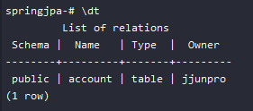

ACCOUNT TABLE 정상적으로 생성 되었습니다.

다음 테이블에 데이터를 넣어보겠습니다.

~~~
String sql = "INSERT INTO ACCOUNT VALUES(1, 'jjunpro', 'pwd');";

try(PreparedStatement statement = connection.prepareStatement(sql)) {
    statement.execute();
}
~~~

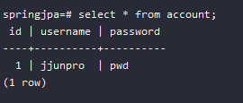

데이터 또한 정상적으로 들어갔습니다.

위와 같은 코딩작업으로 일어나는 단점이 있습니다.

- ACCOUNT 라는 Domain 이라는 클레스를 맵핑을 해줘야 하는 테이블 생성하는 것이 번거롭고 또 테이블에서 가져온 데이터를 우리가 가지고 있는 Domain 객체로 맵핑하는 과정 자체도 번거롭습니다.

- Connection connection 을 만드는 비용이 많이 크고 오래걸립니다. 객체 자체가 마음대로 생성할 수 없습니다.

- SQL 표준이 다 달라서 사용한는 SQL 이 변경될 경우 쿼리 실행에 문제가 발생합니다.

# ORM Object-Relation Mapping

> JDBC 사용

~~~
try(Connection connection = DriverManager.getConnection(url, username, password))  {
    String sql = "INSERT INTO ACCOUNT VALUES(1, 'jjunpro', 'pwd');";
    try(PreparedStatement statement = connection.prepareStatement(sql)) {
        statement.execute();
    }
}
~~~

> 도메인 모델 사용

~~~
Account account = new Account("jjunpro", "pwd");
accountRepository.save(account);
~~~

- JDBC 대신 도메인 모델을 사용하려는 이유
    - 객체 지향 프로그래밍의 장점을 활용하기 좋음
    - 각종 디자인 패턴
    - 코드 재사용
    - 비즈니스 로직 구현 및 테스트 편리

ORM은 어플리케이션의 클래스와 SQL 데이터베이스의 테이블 사이의 `맵핑 정보를 기술한 메타데이터`를 사용하여, 자바 애플리케이션의 객체를 SQL 데이터베이스의 테이블에 `자동으로 (또 깨끗하게) 영속화 해주는 기술`입니다.

# ORM : 패러다임 불일치

객체를 릴레이션에 맴핑하려니 발생하는 문제들과 해결책

릴레이션 (relation) 

같은 성격의 데이터들의 집합을 의미. 흔히 테이블이라고 말하는 용어와 같은 의미로 이론적인 용어. 
릴레이션은 튜플과 에트리뷰트로 데이터를 정렬하여 관리한다. 

- 밀도(Granularity) 문제
    - 객체
        - 다양한 크기의 객체를 만들 수 있음.
        - 커스텀한 타입 만들기 쉬움.
    - 릴레이션
        - 테이블
        - 기본 데이터 타입 (UDT는 비추)

- 서브타입(Subtype) 문제
    - 객체
        - 상속 구조 만들기 쉬움.
        - 다형성
    - 릴레이션
        - 테이블 상속이라는게 없음.
        - 상속 기능을 구현했다 하더라도 표쥰 기술이 아님.
        - 다형적인 관계를 표현할 방법이 없음.

- 식별성(identity) 문제
    - 객체
        - 레퍼런스 동일성 (==)
        - 인스턴스 동일성 (equais() 메소드)
    - 릴레이션
        - 주키 (primary key)

- 관계(Association) 문제
    - 객체
        - 객체 레퍼런스로 관계 표현
        - 근본적으로 "방향"이 존재한다.
        - 다대다 관계를 가질 수 있음
    - 릴레이션
        - 외래키(foreign key)로 관계 표현
        - "방향"이라는 의미가 없음. 그냥 Join 으로 아무거나 묶을 수 있음
        -   태생적으로 다대다 관계를 못만들고, 조인 테이블 또는 링크 테이블을 사용해서 두개의 1대다 관계로 풀어야 함.

- 데이터 네비게이션(Navigation)의 문제
    - 객체
        - 레퍼런스를 이용해서 다른 객체로 이동 가능.
        - 콜렉션을 순회할 수도 있음.
    - 릴레이션
        - 하지만 그런 방식은 릴레이션에서 데이터를 조회하는데 있어서 매우 비효율적이다.
        - 데이터베이스에 요청을 적게 할 수록 성능이 좋다. 따라서 Join을 쓴다.
        - 하지만 너무 많이 한번에 가져오려고 해도 문제다.
        - 그렇다고 lazy loading을 하자니 그것도 문제

# JPA 프로그래밍 프로젝트 셋팅

- 데이터베이스 실행
    - PostgreSQL 도커 컨테이너 재사용
    - docker start postgres_boot

- 스프링 부트
    - 스프링 부트 v2
    - 스프링 프레임워크 v5

- 스프링 부트 스타터 JPA
    - JPA 프로그래밍에 필요한 의존성 추가
        - JPA v2
        - Hibemate v5
    - 자동 설정 : HibemateJpaAutoConfiguration
        - 컨테이너가 관리하는 EntityManager (프록시) 빈 설정
        - PlatformTransactionManager 빈 설정

- JDBC 설정
    - jdbc:postgresql://localhost:5432/springjpa
    - jjunpro
    - pass

https://start.spring.io/ 링크에서 spring boot jpa 의존성을 추가하여 프로젝트를 생성 후 import 합니다.

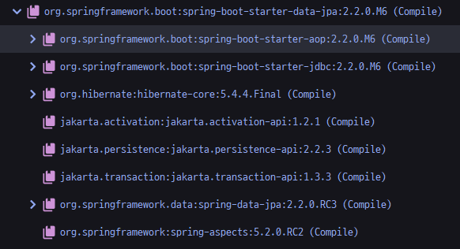

gradle에 설치된 의존성을 확인하면 jpa, hibernate 가 있는것을 확인할 수 있습니다.

엔티티매니저 가 JPA 스펙의 일부이고 엔티티매니저 내부적으로 hibernate를 사용합니다. 그러므로 둘다 사용 가능합니다. JPA 기반으로 코딩할 수 있고 hibernate 기반으로 도 코딩이 가능합니다. 하지만 둘다 사용하는 일은 거의 없습니다.

## 자동 설정 HibemateJpaAutoConfiguration

> application.properties

~~~
spring.datasource.url=jdbc:postgresql://localhost:5432/springjpa
spring.datasource.username=jjunpro
spring.datasource.password=pass

spring.jpa.hibernate.ddl-auto=create
spring.jpa.properties.hibernate.jdbc.lob.non_contextual_creation=true

spring.jpa.show-sql=true
spring.jpa.properties.hibernate.format_sql=true

logging.level.org.hibernate.type.descriptor.sql=trace
~~~

application.properties 에 우리가 사용하는 DB에 접근할수 있는 정보를 줘야합니다.

> spring.jpa.hibernate.ddl-auto=create

- spring.jpa.hibernate.dll-auto : create, create-drop, update, validate, none 옵션을 설정할 수 있습니다.
- create : JPA가 DB와 상호작용할 때 기존에 있던 스키마(테이블)을 삭제하고 새로 만드는 것을 뜻합니다.
- create-drop : JPA 종료 시점에 기존에 있었던 테이블을 삭제합니다.
- update : JPA에 의해 변경된 부분만 반영합니다.
- validate : 엔티티와 테이블이 정상 매핑되어 있는지만 검증합니다.
- none : 초기화 동작을 사용하지 않습니다.

> spring.jpa.show-sql=true

쿼리문을 표시합니다.

> spring.jpa.properties.hibernate.format_sql=true

SQL 문 쿼리가 좀더 보기 쉽게 표시되도록 하는 설정입니다.

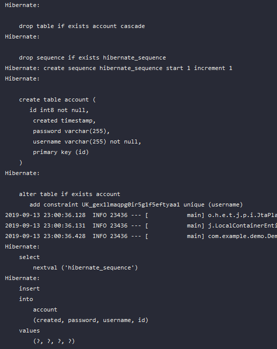

결과 쿼리문이 표시되는 것을 확인할 수 있습니다.

> logging.level.org.hibernate.type.descriptor.sql=trace

쿼리에 들어간 값을 확인할 수 있습니다.

~~~
Hibernate: 
    insert 
    into
        post
        (title, id) 
    values
        (?, ?)

2019-09-15 14:03:32.507 TRACE 16940 --- [           main] o.h.type.descriptor.sql.BasicBinder      : binding parameter [1] as [VARCHAR] - [게시글 생성]
2019-09-15 14:03:32.510 TRACE 16940 --- [           main] o.h.type.descriptor.sql.BasicBinder      : binding parameter [2] as [BIGINT] - [4]
~~~

# Domain 생성

> Account.java

~~~
@Entity
@Table
public class Account {

    @Id
    @GeneratedValue
    private Long id;

    @Column
    private String username;

    @Column
    private String password;

    ...getter, setter
}

~~~

어노테이션 @Entity 를 선언하여 Account 라는 Domain Class을 생성합니다.

`@Entity` 해당 클래스가 DB에 존재하는 Account 테이블에 맵핑이되는 Entity라고 알려주는 어노테이션 입니다.

`@Id` 는 DB의 주 키의 맵핑이 되는 어노테이션

`@GeneratedValue` 해당 값이 자동으로 생성되는 값이라고 알려주는 것

`@Table, @Column` 해당 테이블의 테이블, 컬럼에 맵핑을 알려주는 어노테이션

@Table 과 @Column 은 생략 가능합니다.

## JPA 데이터 영속화

> JpaRunner

~~~
@Component
@Transactional
public class JpaRunner implements ApplicationRunner {

    @PersistenceContext
    private EntityManager entityManager;

    @Override
    public void run(ApplicationArguments args) throws Exception {
        Account account = new Account();
        account.setUsername("new user");
        account.setPassword("new pwd");

        entityManager.persist(account);
    }
}
~~~

EntityManager JPA 가장 핵심적인 클래스 타입의 Bean을 주입받을 수 있습니다. 그러므로 해당 클래스가 JPA 의 핵심입니다.

entityManager 클래스를 가지고 Entity 들을 `영속화` 할 수 있습니다. 즉 `데이터를 저장 한다는 의미입니다.`

위에서는 persist() 메소드를 통해서 `account Entity 를 영속화`합니다.

그리고 `EntityManager 과 관련된 모든 오퍼레이션 들은 한 Transactional 안에서 일어나야 합니다.` 그러므로 @Transactional 어노테이션을 상단에 추가합니다. 사용하는 해당 메소드 위에 바로 작성해도 됩니다.

실행 결과를 확인해보면 정상적으로 데이터 값이 저장된 것을 확인 하였습니다.

## hibernate 영속화

JPA는 hibernate 를 사용합니다. 그러므로 hibernate API도 사용할 수 있습니다.

hibernate 의 가장 핵심적은 API는 `Session` 입니다.

~~~
@Component
@Transactional
public class JpaRunner implements ApplicationRunner {

    @PersistenceContext
    private EntityManager entityManager;

    @Override
    public void run(ApplicationArguments args) throws Exception {
        Account account = new Account();
        account.setUsername("new user");
        account.setPassword("hibernate");

        Session session = entityManager.unwrap(Session.class);
        session.save(account);
    }
}
~~~

# JPA 엔티티 맵핑

도메인 모델을 만들었다면 `릴레이션(테이블)에 어떻게 맵핑` 시킬지 그런 정보를 `HibemateJ(하이버네이트)` 한테 줘야합니다. 정보를 주는 방법은 크게 두가지가 있습니다.

- 1. 어노테이션을 사용하는 방법
- 2. XML을 사용하는 방법

하지만 최근에는 어노테이션을 사용하여 맵핑시켜주는 방법을 많이 사용합니다.

## 어노테이션 정보

- @Entity
    - "엔티티"는 객체 세상에서 부르는 이름.
    - 보통 클래스와 같은 이름을 사용하기 때문에 값을 변경하지 않음.
    - 엔티티의 이름은 JQL 에서 쓰임.
    - @Entity(name = "newName") 으로 선언할 경우 하이버네이트 객체 내부 안에서만 선언된 이름으로 사용됩니다.

- @Table
    - "릴레이션(테이블)" 세상에서 부르는 이름
    - @Table 이름을 선언해주지 않으면 @Entity의 이름으로 기본값을 가집니다.
    - 테이블의 이름은 SQL 에서 쓰임.

- @Id
    - 엔티티의 `주키를 맵핑`할 때 사용.
    - 자바의 모든 Primitive Type(원시 타입)과 그 Reference Type(참조 타입) 을 사용할 수 있음.
        - Date랑 BigDecimal, Biginteger도 가용 가능.
    - 복합키를 만드는 맵핑하는 방법도 있습니다.
    - 보통 Reference Type 을 사용하요 (Long id) 식으로 만들어 구분을 명확하게 해줍니다. 테이블의 Id가 0인 레코드를 가진 Account 랑 새로만든 Account는 Reference가 Null 이라서 완전히 구분이 됩니다. Primitive 으로 (long id)로 사용할 경우 Account는 Reference도 0 이기때문에 테이블의 Id 0 값과 겹칩니다.

- @GeneraledValue
    - `주키의 생성 방법을 맵핑`하는 어노테이션
    - 생성 전략과 생성기를 설정할 수 있다.
        - 기본 전략은 AUTO, 사용하는 DB에 따라 적절한 전략 선택
        - TABLE, SEQUENCE, IDENTITY 중 하나. DB에 따라 달라집니다.

- @Column
    - nuique
    - nullable
    - length
    - columnDefinition 등등..

- @Temporal
    - 현재 JPA 2.1까지는 Date와 Calendar만 지원.

- @Transient
    - 컬럼으로 맵핑하고 싶지 않은 멤버 변수에 사용.

~~~
@Entity
public class Account {

    @Id
    @GeneratedValue
    private Long id;

    @Column(nullable = false, unique = true)
    private String username;

    private String password;

    @Temporal(TemporalType.TIMESTAMP)
    private Date created = new Date();

    @Transient
    private String no;

    ...getter, setter
} 
~~~

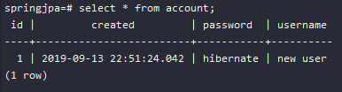

# JPA Value 타입 맵핑

~~~
public class Account {
    private String username;
}
~~~

엔티티 타입은 class Account 를 가리키고 `Value 타입은 String username` 을 가리킵니다.

간단한 예를 들어 Address 클래스가 존재합니다.

~~~
public class Address { ... }
~~~

Address 가 Account 엔티티에 Value 타입으로 들어가있으면 Address 클래스는 엔티티가 아닙니다. 그 이유는 Account 가 만들어 질때 같이 만들어 져야 하고 생명주기가 Account에 있습니다. 이러한 다른 엔티티에 종속적인 타입을 Value 타입이라고 보면 됩니다.

Value 타입선언은 해당 클래스에 @Embeddable 을 선언해 주면 됩니다.

Composite 한 타입을 사용하는 방법은 @Embeddable 어노테이션을 붙여서 사용하면 됩니다.

~~~
@Embeddable
public class Address {

    @Column
    private String street;

    @Column
    private String city;

    @Column
    private String state;

    @Column
    private String zipCode;
}
~~~

~~~
@Entity
class Account {

    @Id
    @GeneratedValue
    private Long id;

    @Column(nullable = false, unique = true)
    private String username;

    private String password;

    @Temporal(TemporalType.TIMESTAMP)
    private Date created = new Date();

    @Transient
    private String no;

    @Embedded
    private Address address;

    ...getter, setter
}
~~~

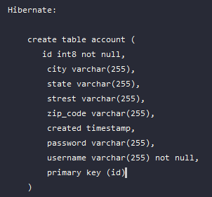

Address 프로퍼티 들을 각각 오버라이딩 하는 방법도 있습니다.

~~~
...
@Embedded
@AttributeOverrides({
    @AttributeOverride(name = "street", column = @Column(name = "home_street"))
})
private Address address;
~~~

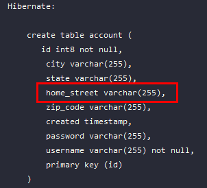

# JPA 1대다 맵핑

- 관계에는 항상 `두 엔티티`가 존재 합니다.
    - `둥 중 하나`는 그 관계의 `주인(owning)`이고
    - `다른 쪽은 종속된(non-owning)`쪽 입니다.
    - 해당 관계의 `반대쪽 레퍼런스를 가지고 있는 쪽이 주인`.

- `단방향`에서의 `관계의 주인은 명확`합니다.
    - `관계를 정의`한 쪽이 그 관계의 `주인`입니다.

- 단방향 @ManyToOne
    - 기본값 FK(Foreign Key) 생성

- 단방향 @OneToMany
    - 기본값은 조인 테이블 생성

- 양방향
    - FK 가지고 있는 쪽이 오너 따라서 기본값은 @ManyToOne 가지고 있는 쪽이 주인.
    - 주인 아닌쪽(@OneToMany쪽)에서 mappedBy 사용해서 관계를 맺고 있는 필드를 설정해야 합니다.

- 양방향
    - @ManyToOne (이쪽이 주인)
    - @OneToMany(mappedBy)
    - 주인한테 관계를 설정해야 DB에 반영이 됩니다.

## 단방향 @ManyToOne Study 가 주인

> Study.java

~~~
@Entity
public class Study {

    @Id
    @GeneratedValue
    private Long id;

    private String name;

    @ManyToOne
    private Account owner;

    ...getter, setter
}
~~~

Study 클래스의 주인은 누구인가 만든이는 누구인가 의 관계를 만들다고 할때 Account owner 관계를 만들 수 있습니다.

이 관계는 어떠한 Study를 만드는 클래스는 `여러개의 Study`를 만들 수 있습니다. 그러면 `Study 입장에서는 ManyToOne 입장`이 되는 것입니다.

> JpaRunner.java

~~~
@Component
@Transactional
public class JpaRunner implements ApplicationRunner {

    @PersistenceContext
    private EntityManager entityManager;

    @Override
    public void run(ApplicationArguments args) throws Exception {
        Account account = new Account();
        account.setUsername("new user");
        account.setPassword("hibernate");

        + Study study = new Study();
        + study.setName("Srping data jpa");
        + study.setOwner(account);

        Session session = entityManager.unwrap(Session.class);
        session.save(account);
        + session.save(study);
    }
}
~~~

study Owner 를 account 를 set 해줍니다.

이러한 과정의 결과는 Study 라는 테이블 안에 `Account 테이블의 PK(Primary Key) 를 참조`하는 `foreign key 컬럼을 생성`해서 `Study 테이블 안에` 가지고 있게 됩니다.

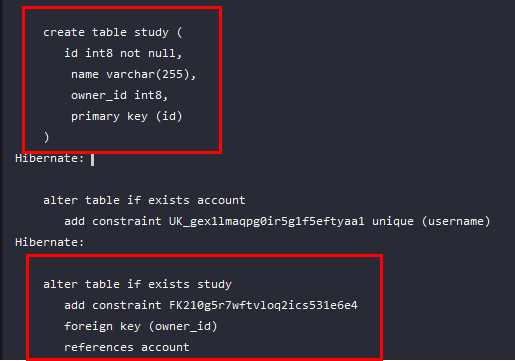

Study 테이블 안에 owner_id 라는 컬럼이 생성됩니다.

owner_id에 대한 constraint(강제,속박)가 foreign key로 잡힙니다.

이 관계에서의 `주인은 Study 엔티티` 입니다. 그 이유는 반대쪽의 엔티티 정보를 Study에서 참조하고 있어서 입니다.

https://jdm.kr/blog/141#단방향_@OneToMany_예제-[SpringBoot-JPA-예제(@OneToMany-단방향)]

## 단방향 @OneToMany Account 가 주인

> Study.java

~~~
@Entity
public class Study {

    @Id
    @GeneratedValue
    private Long id;

    private String name;

    ...getter, setter
}
~~~

Study 엔티티에서 더이상 Account owner 를 관리하지 않습니다. 
대신에 Account owner 쪽에서 관리합니다.

> Account.java

~~~
@Entity
class Account {

    @Id
    @GeneratedValue
    private Long id;

    @Column(nullable = false, unique = true)
    private String username;

    private String password;

    @Temporal(TemporalType.TIMESTAMP)
    private Date created = new Date();

    @Transient
    private String no;

    @Embedded
    private Address address;

    @OneToMany
    private Set<Study> studies = new HashSet<>();

    ...getter, setter
}
~~~

Account 엔티티는 자기가 만든 Study 목록을 가지고 있다고 가정한다면
한 클래스가 하나의 Study만 만든다 는 맞지 않기 때문에 한 클래스가 여러개의 Study를 만들다는 것이 옳바릅니다. 그래서 OneToMany 입니다. (하나가 여러개를 대함)

> JpaRunner.java

관계 설정은 어디서 할 수 있냐면 `주인인 쪽에서 관계 설정`을 할 수 있습니다. 이제는 Account 가 Study 관계를 가지고 있으므로 주인 입니다.

~~~
@Component
@Transactional
public class JpaRunner implements ApplicationRunner {

    @PersistenceContext
    private EntityManager entityManager;

    @Override
    public void run(ApplicationArguments args) throws Exception {
        Account account = new Account();
        account.setUsername("new user");
        account.setPassword("hibernate");

        Study study = new Study();
        study.setName("Srping data jpa");

        + account.getStudies().add(study);

        Session session = entityManager.unwrap(Session.class);
        session.save(account);
        session.save(study);
    }
}
~~~

결과 확인

~~~
Hibernate: 
    drop table if exists study cascade

Hibernate: 
    drop sequence if exists hibernate_sequence

Hibernate: create sequence hibernate_sequence start 1 increment 1

Hibernate:     
    create table account (
       id int8 not null,
        city varchar(255),
        state varchar(255),
        home_street varchar(255),
        zip_code varchar(255),
        created timestamp,
        password varchar(255),
        username varchar(255) not null,
        primary key (id)
    )

Hibernate: 
    create table account_studies (
       account_id int8 not null,
        studies_id int8 not null,
        primary key (account_id, studies_id)
    )

Hibernate: 
    create table study (
       id int8 not null,
        name varchar(255),
        primary key (id)
    )

Hibernate: 
    alter table if exists account 
       add constraint UK_gex1lmaqpg0ir5g1f5eftyaa1 unique (username)

Hibernate: 
    alter table if exists account_studies 
       add constraint UK_tevcop76y9etp9vx5vce7gns6 unique (studies_id)

Hibernate: 
    alter table if exists account_studies 
       add constraint FKem9ae62rreqwn7sv2efcphluk 
       foreign key (studies_id) 
       references study

Hibernate: 
    alter table if exists account_studies 
       add constraint FK4h3r1x3qcsugrps8vc6dgnn25 
       foreign key (account_id) 
       references account
~~~

(account, account_studies, study) 테이블이 3개가 생성되었습니다.

account_studies 테이블이 account id와 study id를 둘다 가지고 있습니다.

만약 데이터를 저장하게 된다면

~~~
Hibernate: 
    insert 
    into
        account
        (city, state, home_street, zip_code, created, password, username, id) 
    values
        (?, ?, ?, ?, ?, ?, ?, ?)

Hibernate: 
    insert 
    into
        study
        (name, id) 
    values
        (?, ?)

Hibernate: 
    insert 
    into
        account_studies
        (account_id, studies_id) 
    values
        (?, ?)
~~~

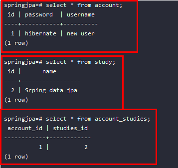

account 데이블에도 study 테이블에도 관계에 대한 정보가 없습니다.

둘의 관계의 대한 정보는 account_studies 정의 되어 있는 것을 확인할 수 있습니다.

## 양방향 관계

Study 는 Account 를 Account는 Study 를 참조하려면 양방향 관계로 만들어야 합니다.

> Study.java

~~~
@Entity
public class Study {

    @Id
    @GeneratedValue
    private Long id;

    private String name;

    @ManyToOne
    private Account owner;
}
~~~

> Account.java

~~~
@Entity
public class Account {

    @Id
    @GeneratedValue
    private Long id;

    @Column(nullable = false, unique = true)
    private String username;

    private String password;

    @OneToMany(mappedBy = "owner")
    private Set<Study> studies = new HashSet<>();
}
~~~

양방향 관계를 만들어 주려면 OneToMany 쪽에 mappedBy 로 이 관계가 반대쪽에 어떻게 맵핑이 되어있는지 관계를 정의한 필드를 작성하면 됩니다.

Study 클래스에서 Account 를 owner 라고 정의를 하였습니다. 이를 Account 클래스에서 owner라는것을 알려주어야 합니다. 그러면 Account 에서 Study의 필요한 관계를 또 생성하지 않고 Study에 정의되어 있는 Account owner 에 종속됩니다. 그러면 Study 가 주인이 됩니다.

그렇다면 지금은 주인은 Study 클래스 입니다.
하지만 Run 코드를 Account 에 Study를 주입하는 방식으로 실행한다면 어떻게 될까요? 그러면 account 에는 아무런 문제가 없지만 Study 테이블의 데이터 owner_id 값에는 아무런 값이 들어가지 않게 됩니다.

~~~
@Override
public void run(ApplicationArguments args) throws Exception {
    Account account = new Account();
    account.setUsername("new user");
    account.setPassword("hibernate");

    Study study = new Study();
    study.setName("Srping data jpa");

    account.getStudies().add(study);

    Session session = entityManager.unwrap(Session.class);
    session.save(account);
    session.save(study);
}
~~~

account.getStudies().add(study);

account 에 study 가 들어가는 입장

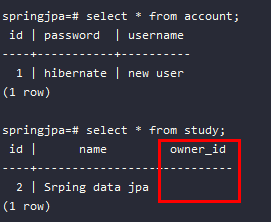

객체적으로 봤을때 둘다 양방향으로 가리키도록 해야합니다.

~~~
account.getStudies().add(study);
study.setOwner(account);
~~~

account 도 study를 study도 account 를 연관있도록 합니다.

이를 쉽게 메소드를 생성하여 사용하도록 합니다.

> Account.java

~~~
// add
public void addStudy(Study study) {
    this.getStudies().add(study);
    study.setOwner(this);
}

// remove
public void removeStudy(Study study) {
    this.getStudies().remove(study);
    study.setOwner(null);
}
~~~

### 양방향 관계를 사용하는 이유

DB 상으론 단방향이든 양방향이든 동일하지만, 객체 관점에서 보면 다릅니다.

JPA를 사용하는 이유 중 하나가 객체지향적으로 프로그래밍을 하기 위함인데, 객체 순회를 어떻게 하느냐에 따라 단방향으로 만들지, 양방향으로 만들지 정해집니다.

가령, Event와 Location이라는 엔티티가 있다고 가정해보죠. Event에서 Location은 당연히 참조해야 할테니 Event -> Location이라는 방향은 보통 레퍼런스로 정의하게 될 겁니다. 그런데 만들 다 보니 어떤 장소에서 열렸던 이벤트 목록도 자주 보여주게 된다면? 그럼 아에 둘의 관계를 양방향으로 만들고, Location을 읽어온 뒤에, Location에서 열렸던 List 목록을 객체로 순회하며 보여줄 수도 있겠죠.

물론, 그렇게 하지않고, 쿼리를 이용해서 조회해올 수도 있겠지만, 가능한한 객체 중심으로 생각하고 코딩하기 편하게 해주는게 JPA의 목적이니 저라면 양방향 관계를 사용해서 그런 문제를 필긴 할 겁니다.

즉, 애플리케이션의 요구 사항이나 기능에 따라 양방향, 단방향이 결정되는 것이지 항상 어느 한쪽이 더 좋다라고 이야기할 수는 없습니다.

좋은 질문 감사합니다.

# JPA Cascade

엔티티의 상태 변화를 전파 시키는 옵션.

- 엔티티의 상태
    - Transient: JPA가 모르는 상태
    - Persistent: JPA가 관리중인 상태 (1차 캐시, Dirty Checking,    Write - Behind, ...)
    - Detached: JPA가 더이상 관리하지 않는 상태.
    - Removed: JPA가 관리하긴 하지만 삭제하기로 한 상태.

## Transient 상태

~~~
Account account = new Account();
account.setUsername("new user");
account.setPassword("hibernate");

Study study = new Study();
study.setName("Srping data jpa");
...
~~~

이상태의 객체들이 `Transient 상태` 입니다. 
`새로 만들어진 객체여서 HibemateJ(하이버네이트), JPA 가 이 객체들을 전혀 모릅니다.`
ID 값이 없어서 DB에 맵핑되어있는 레코드가 전혀 없습니다. 
이 객체들은 이 자체로 DB에 들어갈지도 모르는 상태

## Persistent 상태

~~~
...
account.addStudy(study);

Session session = entityManager.unwrap(Session.class);
session.save(account);
session.save(study);
~~~
session 을 통해서 저장을 하게되면 
`HibemateJ(하이버네이트), JPA 가 이 객체들을 관리하는 상태`가 됩니다.

`save를 했다고 해서 바로 DB에 들어가는 것은 아닙니다.`
HibemateJ(하이버네이트)가 Persistent 상태 로 관리하고 있다가 어느 시점이 되면 DB에 싱크업을 시켜주는 시점에 DB에 싱크업 합니다.

Persistent 상태에서는 HibemateJ(하이버네이트)가 여러가지 일을 해줍니다. 

- 1차 캐시 save 단계 입니다.
    - `EntityManager, session 을 보통 Persistent context` 라고 부릅니다. 해당 인스턴스를 넣어 둔것입니다. 즉 캐시가 된 상태입니다.

캐시가 등록된 상태에서 인스턴스를 달라고 하면

~~~
Account jjunpro = session.load(Account.class, account.getId());
~~~

SELECT 쿼리가 작동하지 않습니다.
이미 session save 내부에 캐시로 저장되어 있기때문에 DB에 접근하지 않고 캐시에 담겨진 값을 가져와 보여주기 때문에 해당 쿼리는 작동하지 않는 것입니다.

좀더 보자면 

~~~
public void run(ApplicationArguments args) throws Exception {
    Account account = new Account();
    account.setUsername("new user");
    account.setPassword("hibernate");

    Study study = new Study();
    study.setName("Srping data jpa");

    account.addStudy(study);

    Session session = entityManager.unwrap(Session.class);
    session.save(account);
    session.save(study);

    Account jjunpro = session.load(Account.class, account.getId());

    jjunpro.setUsername("go user");
    jjunpro.setUsername("very five");
    jjunpro.setUsername("new user");
}
~~~

결과는 업데이트 쿼리는 일어나지 않습니다.
그 이유는 이전에 account 이름이 "new user" 이기 때문에 캐시에서 체크하여 변경할 필요가 없다고 판단하고 실행하지 않은것 입니다.
이런면에서 성능적인 장점이 보입니다.

## Detached 상태

한번이라도 DB에 Persistent가 됐던 객체 즉 이 객체의 맵핑이 되는 레코드가 테이블에 존재하는 경우 
해당 객체의 ID가 존재하는 경우

트랜잭션이 끝나고 Session 밖으로 나왔을 때 JPA가 더이상 관리하지 않는 상태 이미 Session이 끝난 상태이기 때문에 1차 캐시, 더티채킹 등등 전혀 발생하지 않습니다. 

- Session.evict()
- Session.clear()
- Session.close()

Detached 상태로 사용하다가 다시 위 기능을 사용하고 싶다면 Persistent 상태로 전환해야 합니다. 그때 사용하는 메소드 목록

- Session.update()
- Session.merge()
- Session.saveOrUpdate()

## Removed 상태

JPA가 관리하긴 하지만 삭제하기로 한 상태 실제 커밋이 일어날때 삭제가 일어납니다.

- Session.delete()

# 완전한 부모자식관계

어떠한 게시글이 존재하고 해당 게시글에 댓글들이 존재하는 상태입니다. 해당 게시글이 저장되면 댓글도 같이 저장되고 삭제되면 댓글도 같이 삭제되는 과정 입니다.

> Post.java

~~~
@Entity
public class Post {

    @Id
    @GeneratedValue
    private Long id;

    private String title;

    @OneToMany(mappedBy = "post")
    private Set<Comment> comments = new HashSet<>();

    public void addComment(Comment comment) {
        this.getComments().add(comment);
        comment.setPost(this);
    }

    ...getter, setter
}
~~~

> Comment.java

~~~
@Entity
public class Comment {

    @Id
    @GeneratedValue
    private Long id;

    private String comment;

    @ManyToOne
    private Post post;

    ...getter, setter
}
~~~

둘은 양방향 관계임을 OneToMany 통해서 선언하였습니다.

~~~
@Override
public void run(ApplicationArguments args) throws Exception {
    Post post = new Post();
    post.setTitle("게시글의 제목");

    Comment comment = new Comment();
    comment.setComment("게시글의 댓글1");
    post.addComment(comment);

    Comment comment1 = new Comment();
    comment1.setComment("게시글의 댓글2");
    post.addComment(comment1);

    Session session = entityManager.unwrap(Session.class);
    session.save(post);
}
~~~

지금 상태에서 DB를 확인해 보면 comment 를 제외한 post 게시글만 저장이 됬습니다. 하지만 Cascade 옵션을 사용해서 post 저장시 comment 까지 저장되도록 하겠습니다.

> Post.java

~~~
@Entity
public class Post {

    @Id
    @GeneratedValue
    private Long id;

    private String title;

    + @OneToMany(mappedBy = "post", cascade = CascadeType.PERSIST)
    private Set<Comment> comments = new HashSet<>();

    public void addComment(Comment comment) {
        this.getComments().add(comment);
        comment.setPost(this);
    }

    ...getter, setter
}
~~~

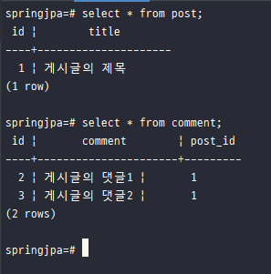

post 와 comment 둘다 Persistent 상태가 되서 post 저장시 같이 저장이 됩니다.

cascade 설정에는 여러가지 설정이 들어갈 수 있습니다.
만약 Post 삭제시 포함된 Comment 까지 삭제되려면?

> Post.java

~~~
...
@OneToMany(mappedBy = "post", cascade = {CascadeType.PERSIST, CascadeType.REMOVE})
~~~

삭제를 추가합니다.

> JpaRunner.java

~~~
@Override
public void run(ApplicationArguments args) throws Exception {

    Session session = entityManager.unwrap(Session.class);
    Post post = session.get(Post.class, 1L);
    session.delete(post);
}
~~~

정상 Post 와 포함된 Comment 들까지 삭제 됩니다.

보통 Cascade 전부 불러와 사용합니다.

> Post.java

~~~
...
@OneToMany(mappedBy = "post", cascade = CascadeType.ALL)
~~~

모두 사용할 수 있습니다.

# JPA Fetch

연관 관계의 엔티티를 언제 어떻게 가져올 것인가? 지금, 나중에

- @OneToMany의 기본값은 Lazy
- @ManyToOne의 기본값은 Eager

> JpaRunner.java

~~~
@Override
public void run(ApplicationArguments args) throws Exception {
    Post post = new Post();
    post.setTitle("게시글의 제목");

    Comment comment = new Comment();
    comment.setComment("게시글의 댓글1");
    post.addComment(comment);

    Comment comment1 = new Comment();
    comment1.setComment("게시글의 댓글2");
    post.addComment(comment1);

    Session session = entityManager.unwrap(Session.class);
    session.save(post);

    // 불러오는것은 별개로 위 주석후..

    Post post1 = session.get(Post.class, 1L);
    System.out.println("show list: " + post1.getTitle());
}
~~~

우선 게시글과 댓글을 작성하였습니다.
그리고 Id 값이 1인 Post 게시물을 Select 합니다.

~~~
Hibernate: 
    select
        post0_.id as id1_2_0_,
        post0_.title as title2_2_0_
~~~

Post title 하나의 데이터만 가져옵니다.

## Eager 지금당자 모든데이터를

> Post.java

~~~
...
+ @OneToMany(mappedBy = "post", cascade = CascadeType.PERSIST, fetch = FetchType.EAGER)
private Set<Comment> comments = new HashSet<>();
...
~~~

OneToMany 설정에 fetch = FetchType.EAGER (지금당장 모든데이터를) 를 추가하였습니다.

~~~
Hibernate: 
    select
        post0_.id as id1_2_0_,
        post0_.title as title2_2_0_,
        comments1_.post_id as post_id3_1_1_,
        comments1_.id as id1_1_1_,
        comments1_.id as id1_1_2_,
        comments1_.comment as comment2_1_2_,
        comments1_.post_id as post_id3_1_2_ 
    from
        post post0_ 
    left outer join
        comment comments1_ 
            on post0_.id=comments1_.post_id 
    where
        post0_.id=?
~~~

left outer join 으로 comment 정보까지 전부 가져온것을 확인합니다.

이번엔 Comment 정보를 가져오겠습니다.

> JpaRunner.java

~~~
Session session = entityManager.unwrap(Session.class);

Comment comment = session.get(Comment.class, 2L);

System.out.println("=======");
System.out.println(comment.getComment());
System.out.println(comment.getPost().getTitle());
~~~

쿼리가 Post 조회하고 Comment 조회하고 두번 날라가지 않습니다.

이미 Comment를 조회할때 FetchType.EAGER 기능으로 Post 의 내용까지 같이 가져왔기 때문입니다.

~~~
Hibernate: 
    select
        comment0_.id as id1_1_0_,
        comment0_.comment as comment2_1_0_,
        comment0_.post_id as post_id3_1_0_,
        post1_.id as id1_2_1_,
        post1_.title as title2_2_1_ 
    from
        comment comment0_ 
    left outer join
        post post1_ 
            on comment0_.post_id=post1_.id 
    where
        comment0_.id=?
~~~

## Lazy 데이터를 나중에 

Post 엔티티는 OneToMany는 기본적으로 Lazy 입니다. Post 정보만 가져옵니다.

Post 정보만 가져온 상태에서 Comment 를 출력해 보겠습니다.

> JpaRunner.java

~~~
Post post = session.get(Post.class, 1L);
System.out.println("=======");
System.out.println(post.getTitle());

post.getComments().forEach(c -> {
    System.out.println("=======");
    System.out.println(c.getComment());
    System.out.println("=======");
});
~~~

n + 1 문제가 발생하지 않고 정상적으로 데이터를 조회합니다.
Post 를 불러오고 Post 에 관련된 댓글의 정보를 불러왔습니다.

여기서 n + 1 문제는 댓글을 두번 혹은 더많이 조회하는것입니다.

~~~
Hibernate: 
    select
        post0_.id as id1_2_0_,
        post0_.title as title2_2_0_ 
    from
        post post0_ 
    where
        post0_.id=?
=======
게시글 제목 입니다.
=======

Hibernate: 
    select
        comments0_.post_id as post_id3_1_0_,
        comments0_.id as id1_1_0_,
        comments0_.id as id1_1_1_,
        comments0_.comment as comment2_1_1_,
        comments0_.post_id as post_id3_1_1_ 
    from
        comment comments0_ 
    where
        comments0_.post_id=?
=======
게시글 댓글 입니다1
=======
=======
게시글 댓글 입니다2
=======
~~~

# JPA Query

지금까지 살펴본 방법은 HibemateJ(하이버네이트) API 의 Session 을 사용하여 데이터를 불러오고 저장했습니다.

## JPQL (HQL)

- SQL 과는 다른점은 데이터베이스 테이블이 아닌, 엔티티 객체 모델 기반으로 쿼리를 작성.
- JPA 또는 하이버네이트가 해당 쿼리를 SQL로 변환해서 실행함.
- https://docs.jboss.org/hibernate/orm/5.2/userguide/html_single/Hibernate_User_Guide.html#hql

간단한 예시

~~~
TypedQuery<Post> query = entityManager.createQuery("SELECT p FROM Post AS p", Post.class);
List<Post> posts = query.getResultList();

// Post 엔티티에 To String 을 추가하여 확인합니다.
posts.forEach(System.out::println);
~~~

결과입니다.

~~~
Hibernate: 
    select
        post0_.id as id1_2_,
        post0_.title as title2_2_ 
    from
        post post0_

Post{id=1, title='게시글의 제목'}
~~~

## Criteria

- 타입 세이프 쿼리
- https://docs.jboss.org/hibernate/orm/5.2/userguide/html_single/Hibernate_User_Guide.html#criteria

~~~
CriteriaBuilder builder = entityManager.getCriteriaBuilder();
    CriteriaQuery<Post> criteria = builder.createQuery(Post.class);
    Root<Post> root = criteria.from(Post.class);
    criteria.select(root);
    List<Post> posts = entityManager.createQuery(criteria).getResultList();
~~~

## Native Query

- SQL 쿼리 실행하기
- https://docs.jboss.org/hibernate/orm/5.2/userguide/html_single/Hibernate_User_Guide.html#sql

~~~
List<Post> posts = entityManager
                .createNativeQuery("SELECT * FROM Post", Post.class)
                .getResultList();
~~~

# 스프링 데이터 JPA 소개 및 원리

- JpaRepository<Entity, id> 인터페이스
    - 매직 인터페이스
    - @Repository가 없어도 빈으로 등록해 줌.

- @EnableJpaRepositories
    - 매직의 시작은 여기서 부터

- 매직은 어떻게 이뤄지나?
    - 시작은 `@Import(JpaRepositoriesRegistrar.class)`
    - 핵심은 `ImportBeanDefinitionRegistrar` 인터페이스

> PostRepository

~~~
@Repository
@Transactional
public class PostRepository {

    @PersistenceContext
    EntityManager entityManager;

    public Post add(Post post) {
        entityManager.persist(post);
        return post;
    }

    public Post delete(Post post) {
        entityManager.remove(post);
    }

    public List<Post> findAll() {
        entityManager.createQuery("SELECT p FROM Post AS p", Post.class)
                .getResultList();
    }
}
~~~

Spring 에 `Bean 으로 등록이 되어야 하므로 @Repository` 가 되야합니다.

JPA 를 사용할 것임으로 `EntityManager 를 @PersistenceContext를 사용하여 Bean 으로 받습니다.` @Autowired 대신에 @PersistenceContext 사용한 이유는 JPA 의 어노테이션을 사용 하므로서 Spring 코드를 최대한 감출수 있기 때문입니다. (Spring 코드를 최대한 감추는 것이 Spring 철학입니다.)

여러가지 CRUD 오퍼레이션들을 만들 수 있지만 테스트 코드도 직접 작성해 줘야하고 여러모로 번거로운 작업이 많습니다. 이를 개선하기 위해서 Repository 를 인터페이스로 만들고 JpaRepository 를 상속받아 사용하는 것입니다. Spring JPA에서 자동으로 Bean 으로 등록이 되기 때문에 따로 Bean 등록은 안해도 됩니다.

~~~
public interface PostRepository extends JpaRepository<Post, Long> {}
~~~

PostRepository 라는 인터페이스를 만들었고 JpaRepository 를 상속받도록 했습니다.
JpaRepository 타입으로 2가지를 주었는데 `첫번째 타입은 Entity 타입`을 `두번재 타입은 Entity에서 사용하는 Id의 타입`

~~~
@Component
@Transactional
public class JpaRunner implements ApplicationRunner {

    @Autowired
    PostRepository postRepository;

    @Override
    public void run(ApplicationArguments args) throws Exception {
        postRepository.findAll().forEach(System.out::println);
    }
}
~~~

간단하게 findAll 메소드 하나로 데이터를 조회합니다.
개발자가 직접 PostRepository 내부에 코드를 작성한 것이 없기 때문에 테스트 코드를 작성할 필요도 없어서 개발 생산성이 좋고 코드 자체가 적어서 유지보수도 좋습니다.

## JpaRepository 동작 원리

원래는 Application main 클래스에 `@EnableJpaRepositories 어노테이션`이 붙어있어야 합니다. 
하지만 Spring Boot 기본설정에 등록되어 있어서 붙이지 않아도 사용 가능합니다.

> @EnableJpaRepositories 

~~~
@Target(ElementType.TYPE)
@Retention(RetentionPolicy.RUNTIME)
@Documented
@Inherited
@Import(JpaRepositoriesRegistrar.class)
public @interface EnableJpaRepositories {
    ...
}
~~~

여기서 @Import(JpaRepositoriesRegistrar.class) 의 `JpaRepositoriesRegistrar 클래스가 JpaRepository 들을 Bean으로 등록해 주는 역할`을 합니다.

> JpaRepositoriesRegistrar.java

~~~
/**
 * {@link ImportBeanDefinitionRegistrar} to enable {@link EnableJpaRepositories} annotation.
 *
 * @author Oliver Gierke
 */
class JpaRepositoriesRegistrar extends RepositoryBeanDefinitionRegistrarSupport {
    ...
}
~~~

`ImportBeanDefinitionRegistrar 프로그래밍을 통해서 Bean자체를 정의할 수 있게 해줍니다.`
결론은 JpaRepository 또는 상속받는 인터페이스 모두를 Bean으로 등록 해준다는 뜻입니다.
이 인터페이스는 스프링 프레임워크의 일부 요소입니다. 

간단하게 예제를 통해서 어떻게 JpaRepository 가 Bean 으로 등록되는지 확인해 보겠습니다.

> Jjunpro.java

~~~
public class Jjunpro {

    private String name;

    public String getName() {
        return name;
    }

    public void SetName(String name) {
        this.name = name;
    }
}
~~~

Jjunpro 클래스를 `Bean 으로 등록하지 않았습니다.`

> JjunproRegistrar.java

~~~
public class JjunproRegistrar implements ImportBeanDefinitionRegistrar {
    
    @Override
    public void registerBeanDefinitions(AnnotationMetadata importingClassMetad) {

        GenericBeanDefinition beanDefinition = new GenericBeanDefinition();        
        beanDefinition.setBeanClass(Jjunpro.class);
        beanDefinition.getPropertyValues().add("name", "Jjunpro");

        registry.registerBeanDefinition("Jjunpro", beanDefinition);
    }
}
~~~

`ImportBeanDefinitionRegistrar` 을 구현하고 Override 를 불러옵니다.

`GenericBeanDefinition 객체로 Jjunpro 클래스를 어떻게 Bean 으로 등록할지 정의`를 하면 됩니다.

registerBeanDefinition 에는 Bean의 이름과 Bean을 정의한 beanDefinition 담아서
Registrar 는 최종적으로 `registerBeanDefinition 을 registry 하면 됩니다.`

`JjunproRegistrar 를 Import 하여 사용`합니다.

> Application.java

~~~
@SpringBootApplication
+ @Import(JjunproRegistrar.class)
public class DemoApplication {

	public static void main(String[] args) {
		SpringApplication.run(DemoApplication.class, args);
	}
}
~~~

@Import 프로그래밍(JjunproRegistrar)을 통해서 Jjunpro가 Bean 으로 등록이 됩니다.

이런과정을 통해서 JPA JpaRepository 가 Bean으로 등록이 되는 것입니다.

# 2부 스프링 데이터 JPA 활용

스프링 데이터는 하나의 프로젝트가 아닌 `여러개의 프로젝트들의 묶음`을 지칭하는 용어입니다.

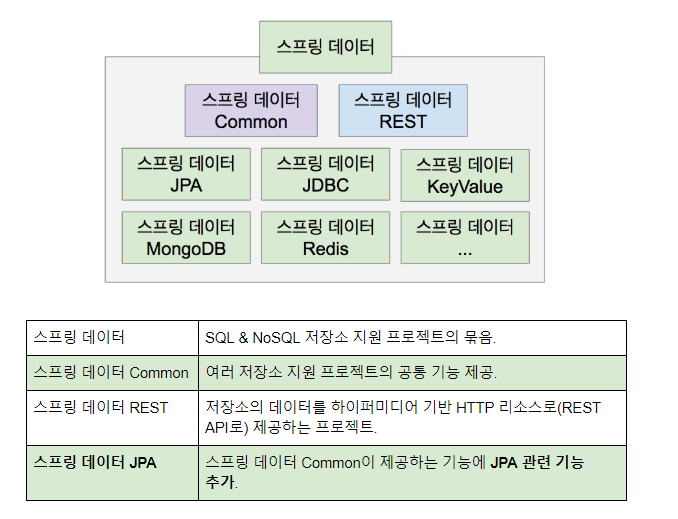

http://projects.spring.io/spring-data/

# 스프링 데이터 Common Repository

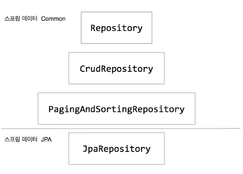

> PostRepository.java

~~~
public interface PostRepository extends JpaRepository<Post, Long> {}
~~~

JpaRepository 를 상속받은 PostRepository 인터페이스가 있습니다.
JpaRepository 는 스프링 데이터 JPA에서 제공해주는 인터페이스로 

> JpaRepository.java

~~~
@NoRepositoryBean
public interface JpaRepository<T, ID> extends PagingAndSortingRepository<T, ID>, QueryByExampleExecutor<T> {
    ...
}
~~~

## PagingAndSortingRepository

PagingAndSortingRepository 를 상속 받고 있는 인터페이스 입니다.
여기서 `PagingAndSortingRepository 부터가 데이터 Common 속하는 인터페이스` 입니다.

> PagingAndSortingRepository.java

~~~
@NoRepositoryBean
public interface PagingAndSortingRepository<T, ID> extends CrudRepository<T, ID> {
    ...
}
~~~

`PagingAndSortingRepository 인터페이스는 페이징과 정렬 기능을 지원`하는 메소드가 있습니다.
기본적인 CrudRepository 인터페이스를 상속 받고 있습니다.

## CrudRepository

> CrudRepository.java

~~~
@NoRepositoryBean
public interface CrudRepository<T, ID> extends Repository<T, ID> {
    ...
}
~~~

CrudRepository 는 `Repository 를 상속받는데 역할은 마커 인터페이스` 입니다.
실질적으로 어떠한 역할을 하는것은 아닙니다.

각각의 중간 단계의 Repository 에는 @NoRepositoryBean 어노테이션이 붙어있습니다.
`@NoRepositoryBean 의 역할은 실제 Bean 을 만들어 등록하지 않도록 방지`해주는 어노테이션 입니다. 실제 Repository 가 아님을 표시한 것입니다.

## Repository Test

~~~
@RunWith(SpringRunner.class)
@DataJpaTest
public class PostRepositoryTest {

    @Autowired
    PostRepository postRepository;

    @Test
    public void crudRepository() {

        // Given
        Post post = new Post();
        post.setTitle("Hello Spring Boot Common");
        assertThat(post.getId()).isNull();

        // When 저장
        Post newPost = postRepository.save(post);

        // Then 존재여부
        assertThat(newPost.getId()).isNotNull();

        // When 모든 검색
        List<Post> posts = postRepository.findAll();

        // Then
        assertThat(posts.size()).isEqualTo(1);
        assertThat(posts).contains(newPost);

        // When Page 기능
        Page<Post> all = postRepository.findAll(PageRequest.of(0, 10));
    }
}
~~~

@DataJpaTest 어노테이션으로 인해서 Repository 관련 Bean 만 등록이 됩니다. (다른 Bean 을 검색하지 않음으로 속도상 빠름)

## Repository 커스텀

> PostRepository.java

~~~
public interface PostRepository extends JpaRepository<Post, Long> {

    Page<Post> findByTitleContains(String title, Pageable pageable);
}
~~~

어떠한 특정한 키워드를 가지고있는 title의 post 목록을 페이징을 해서 찾겠다 
키워드와 페이징 파라미터를 넘겨줍니다. 그러면

findByTitleContains 이름을 분석해서 쿼리를 만들어 줍니다.

# 스프링 데이터 Common Repository 인터페이스 정의하기

JpaRepository 상속받으면서 들어오는 많은 기능을 직접 정의하여 사용하고 싶다면 

> CommentRepository.java

~~~
@RepositoryDefinition(domainClass = Comment.class, idClass = Long.class)
public interface CommentRepository {

    Comment save(Comment comment);

    List<Comment> findAll();
}
~~~

`@RepositoryDefinition 어노테이션을 사용`하여 도메인 클레스와 Entity에서 사용하는 Id의 타입을 넣어 불러옵니다.

기본적인 CRUD 기능의 save 과 findAll `딱 두 기능만 가지고 있는` Repository 이전 모든 메소드를 불러오는 Repository와는 가벼운 인터페이스가 됐습니다.

> CommentRepositoryTest.java

~~~
@RunWith(SpringRunner.class)
@DataJpaTest
public class CommentRepositoryTest {

    @Autowired
    CommentRepository commentRepository;

    @Test
    public void crud() {
        Comment comment = new Comment();
        comment.setComment("hello comment");
        commentRepository.save(comment);

        List<Comment> all = commentRepository.findAll();
        assertThat(all.size()).isEqualTo(1);
    }
}
~~~

만약에 직접 정의하는 Repository 들의 save, findAll 메소드가 공통적으로 들어간다면
공용 Repository 를 따로 정의하여 사용하면 됩니다.

> MyRepository.java

~~~
@NoRepositoryBean
public interface MyRepository<T, Id extends Serializable> extends Repository<T, Id> {

    <E extends T> E save(E entity);

    List<T> findAll();
}
~~~

`Repository 빈등록을 제외하는 어노테이션 @NoRepositoryBean 추가`합니다.
Repository 틀을 제공하는 인터페이스를 상속하고 엔티티와 Id를 받도록 합니다.

MyRepository 의 Id 는 Serializable 타입으로 받아야 합니다.

> CommentRepository.java

~~~
@RepositoryDefinition(domainClass = Comment.class, idClass = Long.class)
public interface CommentRepository extends MyRepository {}
~~~

MyRepository 상속 받음으로 나만의 Repository를 만들어 사용하였습니다.

# 스프링 데이터 Common Null 처리하기

~~~
@NoRepositoryBean
public interface MyRepository<T, Id extends Serializable> extends Repository<T, Id> {

    <E extends T> E save(E entity);

    List<T> findAll();

    <E extends T> Optional<E> findById(Id id);
}
~~~

리턴값이 `한개(단일값)의 경우 Optional` 을 사용해서 해당 엔티티의 `리턴값이 Null` 을 체크하여 적당한 방향으로 안내해줍니다.

> CommentRepositoryTest.java

~~~
...
Optional<Comment> comment = commentRepository.findById(100);
assertThat(comment).isEmpty();
Comment comment = comment.orElse(new Comment());
...
~~~

결과값의 `Null 값을 체크하여 Optional API 가 제공`하는 메소드로 예외를 만들어 줍니다.

~~~
Optional<Comment> comment = commentRepository.findById(100);
if(comment == null) {
    throw new exception();
}
~~~

직접 null 체크를 해서 예외를 만들어 줘도 되지만 `요즘 추세에는 null을 직접 체크하는 방법은 권장하지 않습니다.`

`여러개의 값의 Null 을 체크할 경우`에는 `(List 의경우) 비어있는 값이 출력`됩니다.
스프링 JPA가 지원하는 `Repository의 Collection 타입들은 결코 Null이 되지 않습니다.`
스프링 JPA의 특징입니다. 

## Null 어노테이션

스프링 프레임워크 5.0부터 지원하는 Null 어노테이션 지원.
런타임 시에 Null 여부 체크를 자동으로 심어주는 역할

- @NonNullApi, @NonNull, @Nullable.
- 런타임 체크 지원 함.
- JSR 305 어노테이션을 메타 어노테이션으로 가지고 있음. (IDE 및 빌드 툴 지원)

~~~
<E extends T> E save(@NonNull E entity);

@Nullable
<E extends T> Optional<E> findById(Id id);

<E extends T> Optional<E> findById(@Nullable Id id);
~~~

`@NonNull Null 값이 들어올 수 없다고 명시`합니다.

`@Nullable return 값이 Null 값일 수 도 있다고 명시`합니다.

파라미터에 명시하고 싶다면 내부에 작성합니다.

하이버네이트에게 가기전에 Null 체크를 합니다.

# 스프링 데이터 Common 쿼리 만들기

스프링 데이터 저장소의 메소드 이름으로 쿼리 만드는 방법

## 메소드 이름을 분석해서 쿼리 만들기 (CREATE)

~~~
List<Comment> findByTitleContains(String keyword);
~~~

TitleContains 에 keyword 가 들어있는 모든 코멘트를 찾아주는 메소드를 정의했습니다.
`메소드이름을 분석해서 스프링 데이터 Common(Spring JPA) 이 쿼리를 만들어 줍니다.`

## 미리 정의해 둔 쿼리 찾아 사용하기 (USE_DECLARED_QUERY)

~~~
@Query("SELECT c FROM Comment AS c") - JPQL
// @Query(value = "SELECT c FROM Comment AS c", nativeQuery = true) - SQL
List<Comment> findByTitleContains(String keyword);
~~~

또는 메소드이름을 분석해서 쿼리를 만들지 않고 `메소드에 붙어있는 부과적인 정보를 토대로 쿼리를 만드는 경우`
기본값은 JPQL 을 사용하고 SQL로 사용한다면 nativeQuery = true 로 선언합니다.

## 미리 정의한 쿼리 찾아보고 없으면 만들기 (CREATE_IF_NOT_FOUND)

~~~
@SpringBootApplication
+ @EnableJpaRepositories(queryLookupStrategy = QueryLookupStrategy.Key.CREATE)
public class DemoApplication {
	public static void main(String[] args) {
		SpringApplication.run(DemoApplication.class, args);
	}
}
~~~

@EnableJpaRepositories 에플리케이션에 선언함으로서 기능을 사용할 수 있습니다.

쿼리 만드는 방법

- 리턴타입 {접두어}{도입부}By{프로퍼티 표현식}(조건식)[(And|Or){프로퍼티 표현식}(조건식)]{정렬 조건} (매개변수)

## 쿼리의 우선순의 결정과 만들어지는 곳

EnableJpaRepositories 어노테이션에서 queryLookupStrategy 메소드로 직접 들어갑니다.
그후 QueryLookupStrategy -> JpaQueryLookupStrategy 까지 들어갑니다.

> queryLookupStrategy.java 

CREATE, USE_DECLATED_QUERY, CREATE_IF_NOT_FOUND

QueryLookupStrategy 에서 설정된 쿼리로 만드는지 이름으로 쿼리를 만드는지 정의해 주는 곳

> JpaQueryLookupStrategy.java

CreateQueryLookupStrategy 메소드 이름으로 만들어내는 방법

DeclaredQueryLookupStrategy 메소드의 이미 정의된 쿼리를 찾아내서 만드는 방법

순서는 fromQueryAnnotation -> fromProcedureAnnotation -> fromMethodWithQueryString

# 쿼리만들기 실습

~~~
기본 예제

List<Person> findByEmailAddressAndLastname(EmailAddress emailAddress, String lastname);
// distinct
List<Person> findDistinctPeopleByLastnameOrFirstname(String lastname, String firstname);
List<Person> findPeopleDistinctByLastnameOrFirstname(String lastname, String firstname);
// ignoring case
List<Person> findByLastnameIgnoreCase(String lastname);
// ignoring case
List<Person> findByLastnameAndFirstnameAllIgnoreCase(String lastname, String firstname);

정렬

List<Person> findByLastnameOrderByFirstnameAsc(String lastname);
List<Person> findByLastnameOrderByFirstnameDesc(String lastname);

페이징

Page<User> findByLastname(String lastname, Pageable pageable);
Slice<User> findByLastname(String lastname, Pageable pageable);
List<User> findByLastname(String lastname, Sort sort);
List<User> findByLastname(String lastname, Pageable pageable);

스트리밍

Stream<User> readAllByFirstnameNotNull();
try-with-resource 사용할 것. (Stream을 다 쓴다음에 close() 해야 함)
~~~

## 비동기 쿼리

- @Async Future<User> findByFirstname(String firstname);               
- @Async CompletableFuture<User> findOneByFirstname(String firstname); 
- @Async ListenableFuture<User> findOneByLastname(String lastname); 

해당 메소드를 스프링 TaskExecutor에 전달해서 별도의 쓰레드에서 실행함.
Reactive랑은 다른 것임

권장하지 않는 이유

테스트 코드 작성이 어려움.
코드 복잡도 증가.
성능상 이득이 없음. 
DB 부하는 결국 같고.
메인 쓰레드 대신 백드라운드 쓰레드가 일하는 정도의 차이.
단, 백그라운드로 실행하고 결과를 받을 필요가 없는 작업이라면 @Async를 사용해서 응답 속도를 향상 시킬 수는 있다.

## 비동기 쿼리 사용법

`백그라운드에서 동작하는 스레드 풀 에다가 이 메소드를 실행하는 작업을 위임`하는 것
별도의 스레드에서 동작 시키는 일을 합니다.

@Async 만 붙인다고 작동하지 않습니다.

Application 클래스에 main 쪽에 @EnableAsync 어노테이션을 붙여 줘야 합니다.
실제 @Async 붙은 메소드 들을 백드라운드 스레드 풀 에 넣어서 실행을 시켜줍니다.

~~~
@SpringBootApplication
+ @EnableAsync
public class DemoApplication {
	public static void main(String[] args) {
		SpringApplication.run(DemoApplication.class, args);
	}
}
~~~

Non-blocking 코드를 만들 수 있습니다.

https://tech.peoplefund.co.kr/2017/08/02/non-blocking-asynchronous-concurrency.html -[Non-blocking-코드란?]

> CommentRepository.java

~~~
public interface CommentRepository extends JpaRepository<Comment, Long> {
    @Async
    Future<List<Comment>> findByCommentContains(String keyword);
}
~~~

`Non-blocking 코드를 만들려면 Future 를 감싸야합니다.`

> CommentRepositoryTest.java

~~~
class CommentRepositoryTest {

    @Autowired
    CommentRepository commentRepository;

    public void crud() throws ExecutionException, InterruptedException {

        Future<List<Comment>> future = commentRepository.findByCommentContains("Spring");

        future.get();
    }
}
~~~

`futrue.get()` 결과가 나올때 까지 기다립니다.
그 전에는 `futrue.isDone()` 으로 결과가 나왔는지 안나왔는지 확인을 할 수 있습니다.

# 커스텀 리포지토리 만들기

쿼리 메소드(쿼리 생성과 쿼리 찾아쓰기)로 해결이 되지 않는 경우 직접 코딩으로 구현 가능.

- 스프링 데이터 리포지토리 인터페이스에 기능 추가
- 스프링 데이터 리포지토리 기본 기능 덮어쓰기 가능
- 구현 방법
    - a. 커스텀 리포지토리 인터페이스 정의
    - b. 인터페이스 구현 클래스 만들기 (기본 접미어는 Impl)
    - c. 엔티티 리포지토리에 커스텀 리포지토리 인터페이스 추가

## 리포지토리 인터페이스에 기능 추가

> Post.java

~~~
@Entity
public class Post {

    @Id
    @GeneratedValue
    private Long id;

    private String title;

    @Lob
    private String content;
}
~~~

내용 같은 경우 255자를 넘을 수 도 있으니 @Lob 어노테이션을 선언해서 255 자 이상을 설정합니다.

> PostRepository.java

~~~
public interface PostRepository extends JpaRepository<Post, Long> {
    
}
~~~

PostRepository 저장소를 하나 만들고

> PostCustomRepository.java

~~~
public interface PostCustomRepository {
    List<Post> findMyPost();
}
~~~

커스텀한 인터페이스를 추가해서 구현하는 방법 우선 PostCustomRepository 를 만들어 줍니다.
PostCustomRepository 인터페이스는 굉장히 독립적입니다. 그 뜻은 Spring, JPA 아무것도 의존하고 있지 않습니다. 완전 깔끔한 POJO 상태입니다.

이제 이것을 구현하는 구현체를 만들어야 합니다.

네이밍은 뒤에 Impl 을 붙여서 생성해야 합니다.

> PostCustomRepositoryImpl.java

~~~
@Repository
@Transactional
public class PostCustomRepositoryImpl implements PostCustomRepository {

    @Autowired
    EntityManager entityManager;

    @Override
    public List<Post> findMyPost() {
        System.out.println("custom findMyPost");
        return entityManager.createQuery("SELECT P FROM Post AS p", Post.class)
                .getResultList();
    }
}
~~~

커스텀 리포지토리를 만들었으니 이제 상속하여 사용해보도록 하겠습니다.

> PostRepository.java

~~~
public interface PostRepository extends JpaRepository<Post, Long>, PostCustomRepository {
    
}
~~~

JpaRepository가 지원하는 기능도 사용하면서 내가 만든 PostCustomRepository 의 기능도 사용하겠다.
그리고 PostRepository 결과를 확인하기 위해서 Test 를 하나 만듭니다.

> PostRepositoryTest.java

~~~
@DataJpaTest
class PostRepositoryTest {

    @Autowired
    PostRepository postRepository;

    @Test
    void contextLoads() {
        postRepository.findMyPost();
    }
}
~~~

~~~
custom findMyPost

Hibernate: 
    select
        post0_.id as id1_0_,
        post0_.content as content2_0_,
        post0_.created as created3_0_,
        post0_.title as title4_0_ 
    from
        post post0_
~~~

정상적으로 기능을 추가한것이 출력되었습니다.

## 리포지토리 기본 기능 덮어쓰기 가능

기본 제공하는 JpaRepository 기능이 개발자 마음에 들지 않는 메소드가 있다면 덮어 사용할 수 있습니다.

어떤 블로그의 글 중에 delete() 기능이 매우 비효율 적이다 라는 글이 있었습니다.
"어차피 데이터를 삭제를 할것인데 왜 로딩을 하느냐" 라는 주장이였습니다. 확인을 해보겠습니다.

> JpaRepository.java / SimpleJpaRepository.java

~~~
public void delete(T entity) {

    Assert.notNull(entity, "Entity must not be null!");

    if (entityInformation.isNew(entity)) {
        return;
    }

    Class<?> type = ProxyUtils.getUserClass(entity);

    T existing = (T) em.find(type, entityInformation.getId(entity));

    // if the entity to be deleted doesn't exist, delete is a NOOP
    if (existing == null) {
        return;
    }

    em.remove(em.contains(entity) ? entity : em.merge(entity));
}
~~~

em.contains(entity) 매니저의 캐싱이된 엔티티가 아닌경우에 em.merge(entity) 를 실행합니다.
merge Detached 상태로 사용하다가 다시 위 기능을 사용하고 싶다면 Persistent 상태로 전환합니다.
그 후 삭제를 합니다. 그렇다고 바로 delete 쿼리가 바로 날아가는 것은 아닙니다. removed 상태가 됩니다. 아직은 엔티티 매니저가 관리를 하는 상태입니다.

엔티티 매니저가 remove를 사용하는 이유 케스케이드 해당 엔티티가 지워지면 다른 엔티티도 지워줘야 하는 엔티티가 있다. ex) post 삭제시 comment 댓글 삭제도 해줘야하는 경우 
이런경우 엔티티 매니저를 통해서 사용해야 합니다. 이런 이유로 인해서 데이터를 로딩하며 체크하는 것입니다.

그래도 나는 내가 재 정의해서 delete() 메소드를 사용하고 싶다. 하면 

> PostCustomRepository.java

~~~
+ public interface PostCustomRepository<T> {

    List<Post> findMyPost();

+   void delete(T entity);
}
~~~

jpa 기본 메소드 delete 와 커스텀한 delete 와 중복이 됩니다.
하지만 Spring data JPA는 항상 내가 만든 커스텀 구현체를 우선순위를 높게 줍니다.

> PostCustomRepositoryImpl.java

~~~
@Repository
@Transactional
public class PostCustomRepositoryImpl implements PostCustomRepository {

    @Autowired
    EntityManager entityManager;

    ...

    @Override
    public void delete(Object entity) {
        System.out.println("custom delete");
        entityManager.remove(entity);
    }
}
~~~

> PostRepository.java

~~~
public interface PostRepository extends JpaRepository<Post, Long>, PostCustomRepository<Post> { }
~~~

# 기본 리포지토리 커스터마이징

`모든 리포지토리에 공통적`으로 추가하고 싶은 기능이 있거나 덮어쓰고 싶은 기본 기능이 있다면 

- JpaRepository를 상속 받는 인터페이스 정의 @NoRepositoryBean
- 기본 구현체를 상속 받는 커스텀 구현체 만들기
- @EnableJpaRepositories에 설정 repositoryBaseClass

> MyRepository.java

~~~
@NoRepositoryBean
public interface MyRepository<T, ID extends Serializable> extends JpaRepository<T, ID> {
    boolean contains(T entiry);
}
~~~

중간에 사용되는 Repository 는 Bean 등록을 제외하기 위해서 @NoRepositoryBean 꼭 붙여 줍니다.
T 엔티티가 contains가 존재유무를 파악하는 메소드 그리고 구현체를 하나 만들어 줍니다.

> AllMyRepository.java

~~~
public class AllMyRepository<T, ID extends Serializable> extends SimpleJpaRepository<T, ID> implements MyRepository<T, ID> {

    private EntityManager entityManager;

    public AllMyRepository(JpaEntityInformation<T, ?> entityInformation, EntityManager entityManager) {
        super(entityInformation, entityManager);
        this.entityManager = entityManager;
    }

    @Override
    public boolean contains(T entity) {
        return entityManager.contains(entity);
    }
}
~~~

생성자가 하나 필요합니다. 왜냐하면 SimpleJpaRepository 부모에다가 super로 호출할 때 entityInformation, entityManager 두개의 인자를 꼭 전달해 줘야하기 때문에 두개의 인자를 받는 생성자를 추가해서 생성하였습니다.

entityManager 가 전달이 됩니다. 직접 bean으로 만들어 전달하는것이 아니라 상위 클래스에서 전달받은 entityManager 를 전달하면 됩니다. (this.entityManager = entityManager;)

contains 여부를 확인합니다.

> DemoApplication.java

~~~
@SpringBootApplication
+ @EnableJpaRepositories(repositoryBaseClass = AllMyRepository.class)
public class DemoApplication {
	public static void main(String[] args) {
		SpringApplication.run(DemoApplication.class, args);
	}
}
~~~

@EnableJpaRepositories 어노테이션을 활용하여 repositoryBaseClass 를 설정하여 전역에 AllMyRepository 를 등록합니다.

최종적으로 PostRepository 에 등록 사용해 보겠습니다.

~~~
public interface PostRepository extends MyRepository<Post, Long> {

}
~~~

JpaRepository 대신에 MyRepository 를 상속받음으로서 
커스텀한 `Repository 의 contains 메소드를 상속받으면서` 동시에 
`JpaRepository 까지 상속받아 사용할 수 있습니다.`

# 도메인 이벤트

도메인 관련 이벤트를 발생시키기

- 스프링 프레임워크의 이벤트 관련 기능
    - https://docs.spring.io/spring/docs/current/spring-framework-reference/core.html#context-functionality-events
    - ApplicationContext extends ApplicationEventPublisher
    - 이벤트: extends ApplicationEvent
    - 리스너
        - implements ApplicationListener<E extends ApplicationEvent>
        - @EventListener

- 스프링 데이터의 도메인 이벤트 Publisher
    - @DomainEvents
    - @AfterDomainEventPublication
    - extends AbstractAggregateRoot<E>
    - 현재는 save() 할 때만 발생 합니다.

Post 와 관련된 이벤트를 하나 만들겠습니다.
Post 라는 글을 사용자가 "발행" 이라는 버튼을 눌렀을때만 퍼블리싱이 된다고 가정하고
그런 퍼블리싱이 일어났을때 개발자가 별도의 이벤트 기반의 프로그래밍을 해야한다고 가정한다.

Post 가 퍼블리싱 됐다. 라는 이벤트를 하나 만들어 줍니다.

> PostPublishedEvent.java

~~~
public class PostPublishedEvent extends ApplicationEvent {

    private final Post post;

    /**
     * Create a new {@code ApplicationEvent}.
     *
     * @param source the object on which the event initially occurred or with
     *               which the event is associated (never {@code null})
     * @param post
     */
    public PostPublishedEvent(Object source, Post post) {
        super(source);
        this.post = (Post) source;
    }

    public Post getPost() {
        return post;
    }
}
~~~

Spring 에서 지원하는 ApplicationEvent 를 상속받아 오버라이드 합니다.

Post 정보가 필요하므로 Post post 를 불러옵니다.

이벤트를 발생시키는 곳(PostPublishedEvent) 이 Post라고 가정합니다.

어떤 Post의 대한 이벤트였는지 Post를 참조할 수 있도록 getter 생성

> PostRepositoryTest.java

~~~ 
@DataJpaTest
class PostRepositoryTest {

    @Autowired
    ApplicationContext applicationContext;

    @Test
    public void event() {
        Post post = new Post();
        post.setTitle("event");
        PostPublishedEvent event = new PostPublishedEvent(post);

        applicationContext.publishEvent(event);
    }
}
~~~

post에서 이벤트를 만들었다고 가정을 하고 실제로는 test에서 퍼블리싱을 하고있지만
이벤트를 post에서 던지는 것처럼 할것입니다.

이제 이벤트 리스너가 필요합니다.

> PostListener.java

~~~
public class PostListener implements ApplicationListener<PostPublishedEvent> {

    @Override
    public void onApplicationEvent(PostPublishedEvent event) {
        System.out.println("====================");
        System.out.println(event.getPost() + "is published!!");
        System.out.println("====================");
    }
}

or 또는

public class PostListener {

    @EventListener
    public void onApplicationEvent(PostPublishedEvent event) {
        System.out.println("====================");
        System.out.println(event.getPost() + "is published!!");
        System.out.println("====================");
    }
}
~~~

기본적으로 이벤트 리스터는 ApplicationListener 을 상속받아 오버라이드 합니다.
이벤트 실행시 발생하는 onApplicationEvent 메소드
PostListener 가 Bean으로 등록이 안되어 있는데 등록을 해줘야 합니다.
간단하게 PostRepositoryTestConfig 를 하나 만들어 Bean 등록합니다.

여기서 잠깐! 근데 왜 Config 따로 만들어 Bean 등록을 하나요? 
PostListener 직접 @Component 로 Bean 등록을 하면 되는거 아닌가요?
결론은 아닙니다. 
이유는 Test 클래스에 @DataJpaTest 어노테이션으로 Jpa 관련 Bean 만 가져오도록 되어 었어서
@Component 로 등록된 정보는 무시해서 가져오지 않게 됩니다. 
그렇다고 @Repository 를 붙이자니 역할에 맞지 않음으로 Config 를 따로 만들어 
불러오게 했습니다.

> PostRepositoryTestConfig.java

~~~
@Configuration
public class PostRepositoryTestConfig {

    @Bean
    public PostListener postListener() {
        return new PostListener();
    }
}
~~~

PostRepositoryTest 이곳에 추가 설정을 import 해줍니다. 

> PostRepositoryTest.java

~~~
@DataJpaTest
+ @Import(PostRepositoryTestConfig.class)
class PostRepositoryTest {
    ...
}
~~~

테스트가 실행될때 PostRepositoryTestConfig 같이 불러와서 Bean으로 등록이 됩니다.
그 후 even 메소드가 가 실행이되면 이전에 작성한 이벤트 리스너 클래스가 잡아서 메세지를 출력합니다.

## PostListener 클래스를 만들지 않고 구현하는 방법

> PostRepositoryTestConfig.java

~~~
@Configuration
public class PostRepositoryTestConfig {

    @Bean
    public ApplicationListener<PostPublishedEvent> postListener() {
        return event -> {
            System.out.println("====================");
            System.out.println(event.getPost() + "is published!!");
            System.out.println("====================");
        };
    }
}
~~~

## Spring Data 의 도베인 이벤트

이벤트 자동 퍼블리싱 기능을 제공해줍니다.
Repository 를 save 할때만 동작합니다.
이벤트를 모아두었다가 save할때 전부 전송시킵니다.

이벤트를 모아두는 곳이 @DomainEvents 어노테이션을 가지고있는 메소드 입니다.

다 보낸다음에 그동안 쌓여있던 이벤트를 컬렉션에 담아두었던 곳을 비워야 합니다. 안 그러면 메모리 누수의 큰 문제가 생깁니다. 
이를 자동으로 비워주는 메소드가 @AfterDomainEventPublication 입니다.

이런 모아두는 메소드와 지어주는 메소드를 따로 구현해야 하지만 미리 구현되어 있는 AbstractAggregateRoot를 사용하겠습니다.

> Post.java

~~~
@Entity
+ public class Post extends AbstractAggregateRoot<Post> {
    ...
}
~~~

Spring Data 가 제공해주는 기능 AbstractAggregateRoot 를 상속받습니다.
AbstractAggregateRoot 내부에 들어가 보면 이미 DomainEvents와 AfterDomainEventPublication를 가지고 있습니다.

~~~
@Test
public void event() {
    Post post = new Post();
    post.setTitle("event");
    PostPublishedEvent event = new PostPublishedEvent(post);

    applicationContext.publishEvent(event);
}
~~~

이것은 위와 같은 개발자가 직접 이벤트를 만들고 이벤트를 던지고 하는 코드들을 직접 할 필요가 없어집니다. save 할때 이벤트만 만들기만 하면 됩니다.

> Post.java

~~~
@Entity
public class Post extends AbstractAggregateRoot<Post> {
    ...
    public Post publish() {
        this.registerEvent(new PostPublishedEvent(this));
        return this;
    }
}
~~~

Post 엔티티에서 publish 하는 이벤트를 만들어서 save할때 메소드를 실행시킵니다.

> PostRepositoryTest.java

~~~
@DataJpaTest
@Import(PostRepositoryTestConfig.class)
class PostRepositoryTest {

    @Autowired
    PostRepository postRepository;

    @Test
    void contextLoads() {
        Post post = new Post();
        post.setTitle("title");

        postRepository.save(post.publish());
    }
}
~~~

save 할때 모여있는 이벤트를 발생 시킵니다.

# QueryDSL

findByFirstNameIngoreCaseAndLastNameStartsWithIgnoreCase(String firstName, String lastName) 
이게 이게 뭐냐... @_@ 어지러우시죠?? 이 정도 되면 그냥 한글로 주석을 달아 두시는게...

- 여러 쿼리 메소드는 대부분 두 가지 중 하나.
    - Optional<T> findOne(Predicate): 이런 저런 조건으로 무언가 하나를 찾는다.
    - List<T>|Page<T>|.. findAll(Predicate): 이런 저런 조건으로 무언가 여러개를 찾는다.
    - QuerydslPredicateExecutor (https://docs.spring.io/spring-data/commons/docs/current/api/org/springframework/data/querydsl/QuerydslPredicateExecutor.html) 인터페이스

- QueryDSL
    - http://www.querydsl.com/
    - 타입 세이프한 쿼리 만들 수 있게 도와주는 라이브러리
    - JPA, SQL, MongoDB, JDO, Lucene, Collection 지원
    - QueryDSL JPA 연동 가이드 (http://www.querydsl.com/static/querydsl/4.1.3/reference/html_single/#jpa_integration)

- 스프링 데이터 JPA + QueryDSL
    - 인터페이스: QuerydslPredicateExecutor<T>
    - 구현체: QuerydslPredicateExecutor<T>

새로운 프로젝트 생성 후 querydsl 의존성 추가와 함께 설정을 해보도록 하겠습니다.

## QueryDSL Gradle 설정

Gradle 5.0 버전 기준 의존성 추가

~~~
+buildscript {
+	ext {
+		querydslPluginVersion = '1.0.10' // 플러그인 버전
+	}
+	repositories {
+		maven { url "https://plugins.gradle.org/m2/" } // 플러그인 저장소
+	}
+	dependencies {
+		classpath("gradle.plugin.com.ewerk.gradle.plugins:querydsl-plugin:${querydslPluginVersion}") // querydsl 플러그인 의존성 등록
+	}
+}

plugins {
	id 'org.springframework.boot' version '2.2.0.M6'
	id 'io.spring.dependency-management' version '1.0.8.RELEASE'
	id 'java'
}

group = 'com.example'
version = '0.0.1-SNAPSHOT'
sourceCompatibility = '1.8'

repositories {
	mavenCentral()
	maven { url 'https://repo.spring.io/milestone' }
}

dependencies {
	implementation 'org.springframework.boot:spring-boot-starter-data-jpa'
	runtimeOnly 'com.h2database:h2'
	runtimeOnly 'org.postgresql:postgresql'
	testImplementation('org.springframework.boot:spring-boot-starter-test') {
		exclude group: 'org.junit.vintage', module: 'junit-vintage-engine'
	}

	compile('org.projectlombok:lombok')

+	compile("com.querydsl:querydsl-jpa") // querydsl
+	compile("com.querydsl:querydsl-apt") // querydsl
}

test {
	useJUnitPlatform()
}

// querydsl 적용
+ apply plugin: "com.ewerk.gradle.plugins.querydsl" // Plugin 적용
+ def querydslSrcDir = 'src/main/generated' // QClass 생성 위치

+ querydsl {
+ 	library = "com.querydsl:querydsl-apt"
+ 	jpa = true
+ 	querydslSourcesDir = querydslSrcDir
+ }

+ sourceSets {
+ 	main {
+ 		java {
+ 			srcDirs = ['src/main/java', querydslSrcDir]
+ 		}
+ 	}
+ }

+ compileQuerydsl{
+ 	options.annotationProcessorPath = configurations.querydsl
+ }

+ configurations {
+ 	querydsl.extendsFrom compileClasspath
+ }
~~~

Java Config Bean 등록

> QuerydslConfiguration.java

~~~
@Configuration
public class QuerydslConfiguration {

    @PersistenceContext
    private EntityManager entityManager;

    @Bean
    public JPAQueryFactory jpaQueryFactory() {
        return new JPAQueryFactory(entityManager);
    }
}
~~~

간단한 예제 도메인 생성

> Account.java

~~~
@Entity
public class Account {

    @Id
    @GeneratedValue
    private Long id;

    private String username;

    private String firstName;

    private String lastName;
}
~~~

QClass 생성 방법

> IntelliJ의 Gradle View를 열어서 Tasks -> other -> compileQuerydsl를 더블클릭으로 실행

build.gradle에서 설정한 위치 (src/main/generated/) 을 보시면 아래와 같이 QClass가 생성된 것을 확인할 수 있습니다.

## QueryDSL 사용법

> AccountRepository.java

~~~
public interface AccountRepository extends JpaRepository<Account, Long>, QuerydslPredicateExecutor<Account> {

}
~~~

QuerydslPredicateExecutor<> 인터페이스를 상속 받습니다.
해당 인터페이스가 제공하는 메소드를 사용할 수 있습니다.
테스트 코드에서 사용해 보도록 하겠습니다.

> AccountRepositoryTest.java

~~~
@DataJpaTest
class AccountRepositoryTest {

    @Autowired
    AccountRepository accountRepository;

    @Test
    public void show() {
        QAccount account = QAccount.account;
        Predicate predicate = account.firstName
                .containsIgnoreCase("spring")
                .and(account.lastName.startsWith("jpa"));

        Optional<Account> one = accountRepository.findOne(predicate);
        assertThat(one).isEmpty();
    }
}
~~~

결과 

~~~
Hibernate: 
    select
        account0_.id as id1_0_,
        account0_.first_name as first_na2_0_,
        account0_.last_name as last_nam3_0_,
        account0_.username as username4_0_ 
    from
        account account0_ 
    where
        (
            lower(account0_.first_name) like ? escape '!'
        ) 
        and (
            account0_.last_name like ? escape '!'
        )

binding parameter [1] as [VARCHAR] - [%spring%]
binding parameter [2] as [VARCHAR] - [jpa%]
~~~

java 코드로 넣어준대로 쿼리가 정상적으로 실행되고 값 또한 정상적으로 들어갔습니다.

추가 참고링크

https://jojoldu.tistory.com/372

https://joont92.github.io/jpa/QueryDSL/

http://www.querydsl.com/static/querydsl/4.0.1/reference/ko-KR/html_single/#d0e1988

## QueryDSL OneToMany or ManyToMany 관계에서 Left Outer Join 이 필요할 경우

아래 코드와 같이 (1:N 관계 그리고 N:N 관계) 의 Entity들이 있습니다.

> University.java

~~~
@Getter
@NoArgsConstructor(access = AccessLevel.PROTECTED)
@Entity
public class University extends BaseEntity {

    @Column(nullable = false)
    private String uniSubject;

    @Column(nullable = false)
    @Type(type = "text")
    private String uniContent;

    @ManyToOne
    private Account account;

    @ManyToMany
    private Set<Account> uniLike = new HashSet<>();

    @Builder
    public University(String uniSubject, String uniContent, Set<Account> uniLike, Account account) {
        this.uniSubject = uniSubject;
        this.uniContent = uniContent;
        this.uniLike = uniLike;
        this.account = account;
    }
}
~~~

> Account.java

~~~
@Getter
@NoArgsConstructor(access = AccessLevel.PROTECTED)
@Entity
public class Account extends BaseEntity {

    @Column(nullable = false, unique = true)
    private String userId;

    @Column(nullable = false)
    private String password;

    @Column(nullable = false)
    @Enumerated(value = EnumType.STRING)
    private UserRole userRole = UserRole.USER;

    @Builder
    public Account(String userId, String password, String email, String[] urlList) {
        this.userId = userId;
        this.password = password;
        this.email = email;
        this.urlList = urlList;
    }
}
~~~

University 게시물의 좋아요를 클릭한 유저의 정보를 모은 `갯수`를 저장하는 uniLike length 컬럼

University 게시물을 만든 유저의 정보를 민감 정보 `Password를 제외한 특정 값`을 가져오고 싶어합니다.

> UniversityPublic.java

~~~
@Data
@AllArgsConstructor
public class UniversityPublic {

    private String uniSubject;
    private String uniContent;
    private String account_userId;
    private Integer uniLike;
}
~~~

프로젝션을 해주기 위해서 University와 Account List가 묶인 DTO 클래스 UniversityPublic.java 만들어 줍니다.

> UniversityRepositoryImpl.java

~~~
@Repository
@RequiredArgsConstructor
public class UniversityRepositoryImpl implements UniversityRepositoryDSL {

    private final JPAQueryFactory queryFactory;

    QUniversity qUniversity = QUniversity.university;

    QAccount qAccount = QAccount.account;

    @Override
    public Page<UniversityPublic> findByPublicAll(Pageable pageable) {

        // 1.
        Map<University, List<Account>> transform = queryFactory
                .from(qUniversity)
                .leftJoin(qUniversity.uniLike, qAccount)
                .transform(groupBy(qUniversity).as(list(qAccount)));

        // 2.
        List<UniversityPublic> results = transform.entrySet().stream()
                .map(
                        u -> new UniversityPublic(
                                u.getKey().getUniSubject(),
                                u.getKey().getUniContent(),
                                u.getKey().getAccount().getUserId(),
                                u.getValue().size()
                        )
                )
                .collect(Collectors.toList());

        return new PageImpl<>(results, pageable, results.size());
    }
}
~~~

에러가 발생하는 경우

- 1. leftJoin을 활용한 Aggregation 결과 집합

~~~
queryFactory
    .from(qUniversity)
    .select(Projections.fields(
        UniversityPublic.class,
        qUniversity.uniSubject,
        qUniversity.uniContent,
        qUniversity.uniLike
    ))
    .from(qUniversity)
    .fetchResults()
~~~ 

단순하게 Projections 하는식으로 UniversityPublic 넣게되면 집합 실패로 인해
List 로 조회되는 qUniversity.uniLike 를 Aggregation 하지 못해서 . 라는 불문명한 컬럼 사용
에러가 발생하게 됩니다.

- 2. 반환된 결과를 transform.entrySet().stream() 활용하여 DTO 에 맞춰 넣어주어 결과를 반환합니다.

https://jojoldu.tistory.com/342?category=637935 - [Querydsl-에서-OneToMany-관계에서-Left-Outer-Join-이-필요할-경우]

# Web DomainClassConverter

- 도메인 클래스 컨버터
    - 도메인의 ID 값을 도메인으로 받아서 파라미터로 받을 수 가 있습니다.

> Post.java

~~~
@Entity
@Getter
@Setter
public class Post {

    @Id
    @GeneratedValue
    private Long id;

    private String title;

    @Temporal(TemporalType.TIMESTAMP)
    private Date created;
}
~~~

> PostRepository.java

~~~
public interface PostRepository extends JpaRepository<Post, Long> {
    
}
~~~

> PostController.java

~~~
@RestController
public class PostController {

    @Autowired
    PostRepository postRepository;

    @GetMapping("/posts/{id}")
    public String getPost(@PathVariable Long id) {
        Optional<Post> byId = postRepository.findById(id);
        Post post = byId.get();

        return post.getTitle();
    }
}

~~~

GetMapping 으로 id 값은 문자열로 들어오지만 Spring web 바인더 기능으로 Long 으로 바꿔줍니다.

> PostControllerTest.java

~~~
@SpringBootTest
@AutoConfigureMockMvc
class PostControllerTest {

    @Autowired
    MockMvc mockMvc;

    @Autowired
    PostRepository postRepository;

    @Test
    public void getPost() throws Exception {
        Post post = new Post();
        post.setTitle("Spring");
        postRepository.save(post);

        mockMvc.perform(get("/posts/" + post.getId()))
                .andDo(print())
                .andExpect(status().isOk())
                .andExpect(content().string("Spring"));
    }
}
~~~

DomainClassConverter 하나의 타입을 다른 타입으로 변환하는 인터페이스 
크게 두가지의 컨버터가 실행이 됩니다. 

ToEntityConverter 어떠한 엔티티의 아이디를 받아서 그 엔티티 타입으로 변환하는 컨버터가 등록이 됩니다.
ToIdConverter 그 엔티티의 아이디 타입으로 변환하는 컨버터

> PostController.java

~~~
@RestController
public class PostController {

    @Autowired
    PostRepository postRepository;

    @GetMapping("/posts/{id}")
    public String getPost(@PathVariable("id") Post post) {
        return post.getTitle();
    }
}
~~~

Post 로 받아 오겠다. 그때 컨버터가 동작을 해서 Long 을 Post 으로 변환해서 값을 자동으로 맞게 넣어줍니다.

# Pageable과 Sort 매개변수

> PostController.java

~~~
@RestController
public class PostController {

    @Autowired
    PostRepository postRepository;

    @GetMapping("/posts")
    public Page<Post> getPosts(Pageable pageable) {
        return postRepository.findAll(pageable);
    }
}
~~~

> PostControllerTest.java

~~~
@SpringBootTest
@AutoConfigureMockMvc
class PostControllerTest {

    @Autowired
    MockMvc mockMvc;

    @Autowired
    PostRepository postRepository;

    @Test
    public void getPosts() throws Exception {
        Post post = new Post();
        post.setTitle("Spring");
        postRepository.save(post);

        mockMvc.perform(get("/posts/")
                    .param("page", "0")
                    .param("size", "10")
                    .param("sort", "created,desc")
                    .param("sort", "title"))
                .andDo(print())
                .andExpect(status().isOk());
    }
}
~~~

# HATEOAS 

- Page를 PagedResource로 변환하기
    - 일단 HATEOAS 의존성 추가 (starter-hateoas)
    - 핸들러 매개변수로 PagedResourcesAssembler

HATEOAS 를 사용하기전에 의존성을 추가합니다.

~~~
// https://mvnrepository.com/artifact/org.springframework.boot/spring-boot-starter-hateoas
compile group: 'org.springframework.boot', name: 'spring-boot-starter-hateoas', version: '2.1.4.RELEASE'
~~~

## IntelliJ IDEA 2018.3 이전 HATEOAS

> PostController.java

~~~
@GetMapping("/posts")
public PagedResources<Resource<Post>> getPosts(Pageable pageable, PagedResourcesAssembler<Post> assembler) {
    Page<Post> all = posts.findAll(pageable);
    return assembler.toResource(all);
}
~~~

PagedResourcesAssembler<T> assembler 매개변수로 전달받아 사용할 수 있습니다.
이 엔티티 타입의 리소스를 만들어 줍니다. Resource<Post> 이것을 또 PagedResources<> 또 감싸줍니다.
PagedResourcesAssembler 가 PagedResources를 만들어 줍니다.

assembler.toResource 는 page를 받습니다.

## IntelliJ IDEA 2018.3 이후 HATEOAS 

> PostController.java

~~~
@RestController
public class PostController {

    @Autowired
    private PostRepository postRepository;

    @GetMapping("/posts")
    public PagedModel<EntityModel<Post>> getPosts(Pageable pageable, PagedResourcesAssembler<Post> assembler) {
        Page page = postRepository.findAll(pageable);
        return assembler.toModel(page);
    }
}
~~~

PagedResourcesAssembler<T> assembler 매개변수로 전달받아 사용할 수 있습니다.
이 엔티티 타입의 리소스를 만들어 줍니다. EntityModel<Post> 이것을 또 PagedModel<> 또 감싸줍니다.
PagedResourcesAssembler 가 PagedModel를 만들어 줍니다.

assembler.toModel 는 page를 받습니다.

https://stackoverflow.com/questions/55770163/resource-and-controllerlinkbuilder-not-found-and-deprecated - [현재-ResourceIDE-(IntelliJ-IDEA-2018.3)]

https://spring.io/blog/2019/03/05/spring-hateoas-1-0-m1-released#overhaul - [Spring-HATEOAS-1.0-M1-released]

## HATEOAS 테스트

> PostControllerTest.java

~~~
import org.springframework.test.web.servlet.ResultMatcher;
import static org.assertj.core.internal.bytebuddy.matcher.ElementMatchers.is;

@Test
public void getPosts() throws Exception {
    Post post = new Post();
    post.setTitle("Spring");
    postRepository.save(post);

    mockMvc.perform(get("/posts/")
                .param("page", "3")
                .param("size", "10")
                .param("sort", "created,desc")
                .param("sort", "title"))
            .andDo(print())
            .andExpect(status().isOk())
            .andExpect((ResultMatcher) jsonPath("$.content[0].title", is("Spring")));
}

@Test
public void createPosts() {
    int postsCount = 100;
    while (postsCount > 0) {
        Post post = new Post();
        post.setTitle("Spring");
        postRepository.save(post);
        postsCount--;
    }
}
~~~

> 결과

~~~

{  
   "content":[  
...
      {  
         "id":111,
         "title":"jpa",
         "created":null
      }
   ],
   "pageable":{  
      "sort":{  
         "sorted":true,
         "unsorted":false
      },
      "offset":20,
      "pageSize":10,
      "pageNumber":2,
      "unpaged":false,
      "paged":true
   },
   "totalElements":200,
   "totalPages":20,
   "last":false,
   "size":10,
   "number":2,
   "first":false,
   "numberOfElements":10,
   "sort":{  
      "sorted":true,
      "unsorted":false
   }
}

리소스로 변환한 뒤

{  
   "_embedded":{  
      "postList":[  
         {  
            "id":140,
            "title":"jpa",
            "created":null
         },
...
         {  
            "id":109,
            "title":"jpa",
            "created":null
         }
      ]
   },
   "_links":{  
      "first":{  
         "href":"http://localhost/posts?page=0&size=10&sort=created,desc&sort=title,asc"
      },
      "prev":{  
         "href":"http://localhost/posts?page=1&size=10&sort=created,desc&sort=title,asc"
      },
      "self":{  
         "href":"http://localhost/posts?page=2&size=10&sort=created,desc&sort=title,asc"
      },
      "next":{  
         "href":"http://localhost/posts?page=3&size=10&sort=created,desc&sort=title,asc"
      },
      "last":{  
         "href":"http://localhost/posts?page=19&size=10&sort=created,desc&sort=title,asc"
      }
   },
   "page":{  
      "size":10,
      "totalElements":200,
      "totalPages":20,
      "number":2
   }
}
~~~

page와 관련되어 있는 리소스 정보들 하이퍼 미디어 정보가 링크로 들어옵니다.
이것이 HATEOAS 의 핵심입니다.

# JpaRepository

@EnableJpaRepositories
- 스프링 부트 사용할 때는 사용하지 않아도 자동 설정 됨.
- 스프링 부트 사용하지 않을 때는 @Configuration과 같이 사용.

@Repository 애노테이션을 붙여야 하나 말아야 하나...
- 안붙여도 됩니다.
- 이미 붙어 있어요. 또 붙인다고 별일이 생기는건 아니지만 중복일 뿐입니다.

스프링 @Repository
- SQLExcpetion 또는 JPA 관련 예외를 스프링의 DataAccessException으로 변환 해준다.

## JpaRepository.save()

JpaRepository의 save()는 단순히 새 엔티티를 추가하는 메소드가 아닙니다.
- Transient 상태의 객체라면 EntityManager.persist()
- Detached 상태의 객체라면 EntityManager.merge()

Transient인지 Detached 인지 어떻게 판단 하는가?
- `엔티티의 @Id 프로퍼티를 찾는다.` 해당 프로퍼티가 null이면 Transient 상태로 판단하고 `id가 null이 아니면 Detached 상태로 판단`한다.
- 엔티티가 Persistable 인터페이스를 구현하고 있다면 isNew() 메소드에 위임한다.
- JpaRepositoryFactory를 상속받는 클래스를 만들고 getEntityInfomration()을 오버라이딩해서 자신이 원하는 판단 로직을 구현할 수도 있습니다.

EntityManager.persist()
- https://docs.oracle.com/javaee/6/api/javax/persistence/EntityManager.html#persist(java.lang.Object)
- Persist() 메소드에 넘긴 그 엔티티 객체를 Persistent 상태로 변경합니다

EntityManager.merge()
- https://docs.oracle.com/javaee/6/api/javax/persistence/EntityManager.html#merge(java.lang.Object)
- Merge() 메소드에 넘긴 그 엔티티의 복사본을 만들고, 그 복사본을 다시 Persistent 상태로 변경하고 그 복사본을 반환합니다.

> PostRepositoryTest.java

~~~
@DataJpaTest
class PostRepositoryTest {

    @Autowired
    private PostRepository postRepository;

    @Test
    public void save() {
        // 1.
        Post post = new Post();
        post.setTitle("Spring");
        Post savePost = postRepository.save(post); // persist

        assertThat(entityManager.contains(post)).isTrue();
        assertThat(entityManager.contains(savePost)).isTrue();
        assertThat(savePost == post);

        // 2.
        Post postUpdate = new Post();
        postUpdate.setId(post.getId());
        postUpdate.setTitle("Spring Update");
        Post updatedPost = postRepository.save(postUpdate); // merge

        assertThat(entityManager.contains(updatedPost)).isTrue();
        assertThat(entityManager.contains(postUpdate)).isFalse();
        assertThat(updatedPost == postUpdate).isFalse();

        List<Post> all = postRepository.findAll();
        assertThat(all.size()).isEqualTo(1);
    }`
}
~~~

1번 객체는 `ID가 존재하지 않는 새로운 객체이므로 Persistent 상태`입니다.
persist 로 넘겨준 post 인스턴스 객체가 entityManager에 영속화가 됩니다.

~~~
entityManager.contains(post).isTrue();
~~~
entityManager 에 post가 영속화 되어있는지 확인합니다.

postRepository.save(post); 에서 항상 리턴되는 인스턴스가 있습니다.
항상 `영속화 되어있는 객체를 리턴`합니다.
결국 `savePost 와 post 는 같습니다. `
같다는 것은 entityManager 가 savePost 도 캐싱 즉 가지고 있다는 것입니다.

~~~
entityManager.contains(post).isTrue(); 
entityManager.contains(savePost)).isTrue(); 
assertThat(savePost == post);
~~~

2번 객체는 `ID를 가지고 있기 때문에 merge 상태`입니다.
그러면 UPDATE 쿼리가 발생하게 되고 `JPA 대신에 하이버네이트로 값을 UPDATE` 하게 됩니다.

postRepository.save(postUpdate); merge의 내부적인 기능으로
전달받은 파라미터의 postUpdate 인스턴스의 복사본을 만듭니다.
`해당 복사본으로 DB에 영속화`를 하고 복사본을 Persistent 상태로 만들고 리턴합니다.

~~~
Post updatedPost = postRepository.save(postUpdate);
~~~

리턴받는 updatedPost 가 영속화가 됩니다.
파라미터로 넘겼던 postUpdate 는 영속화가 되지 않습니다.
이 둘의 객체는 같지도 않습니다.

~~~
assertThat(entityManager.contains(updatedPost)).isTrue();
assertThat(entityManager.contains(postUpdate)).isFalse();
assertThat(updatedPost == postUpdate).isFalse();
~~~

persist, merge 판단하지 말고 
어떤한 경우라도 리턴값을 받는 것이 좋습니다.
실수를 줄이기 위해선 무조건 리턴받은 인스턴스를 사용하면 됩니다.
파라미터로 전달한 인스턴스를 계속해서 뒤에서 사용하면 안됩니다. 
간단한 예제

~~~
Post postUpdate = new Post();
postUpdate.setId(post.getId());
postUpdate.setTitle("Spring Update");
Post updatedPost = postRepository.save(postUpdate);

postUpdate.setTitle("Spring No! Update!");
~~~

postUpdate 객체는 persist 상태가 아닙니다. 
그러면 상태변화를 감지하지 않습니다.
Test 결과 UPDATE 쿼리는 날라가지 않습니다.

~~~
updatedPost.setTitle("Spring No! Update!");
~~~

persist 상태 객체 를 사용하면 정상 UPDATE가 됩니다.

# 쿼리메소드

쿼리 생성하기
- https://docs.spring.io/spring-data/jpa/docs/current/reference/html/#jpa.query-methods.query-creation
- And, Or
- Is, Equals
- LessThan, LessThanEqual, GreaterThan, GreaterThanEqual
- After, Before
- IsNull, IsNotNull, NotNull
- Like, NotLike
- StartingWith, EndingWith, Containing
- OrderBy
- Not, In, NotIn
- True, False
- IgnoreCase

- 쿼리 찾아쓰기
    - 엔티티에 정의한 쿼리 찾아 사용하기 JPA Named 쿼리
        - @NamedQuery
        - @NamedNativeQuery

리포지토리 메소드에 정의한 쿼리 사용하기
    - @Query
    - @Query(nativeQuery=true)

## @NamedQuery

> Post.java

~~~
@Entity
@NamedQuery(name = "Post.findByTitle", query = "SELECT p FROM Post AS p WHERE p.title = ?1")
public class Post {
    ...
}
~~~

NamedQuery 를 정의함으로서 Repository 에서 탐색 후 실행합니다.

엔티티 객체가 지져분 해지기 때문에 권장하지 않습니다.

## 쿼리 메소드 Sort

이전과 마찬가지로 Pageable이나 Sort를 매개변수로 사용할 수 있는데, @Query와 같이 사용할 때 제약 사항이 하나 있습니다.

Order by 절에서 함수를 호출하는 경우에는 Sort를 사용하지 못합니다. 그 경우에는 JpaSort.unsafe()를 사용 해야 합니다.
- Sort는 그 안에서 사용한 `프로퍼티 또는 alias`가 엔티티에 없는 경우에는 예외가 발생합니다.
- JpaSort.unsafe()를 사용하면 함수 호출을 할 수 있습니다.
    - JpaSort.unsafe(“LENGTH(firstname)”);

> PostRepository.java

~~~
public interface PostRepository extends JpaRepository<Post, Long> {

    @Query("SELECT p FROM Post AS p WHERE p.title = ?")
    List<Post> findByTitle(String title, Sort sort);
}
~~~

Sort sort 파라미터로 추가합니다.
프로퍼티 또는 alias 만 올 수 있습니다.

> findByTitle.java

~~~
@Test
public void findByTitle() {
    Post post = new Post();
    List<Post> all = postRepository.findByTitle("Spring", Sort.by("title"));
}
~~~

title 프로퍼티 이므로 sort 추가하여 정렬할 수 있습니다.

예외의 상황

~~~
@Test
public void findByTitle() {
    Post post = new Post();
    List<Post> all = postRepository.findByTitle("Spring", Sort.by("LENGTH(title)"));
}
~~~

title 길이로 정렬 옵션 프로퍼티 또는 alias 아니라서 오류가 발생합니다.
이를 우회해서 사용하려면 JpaSort 를 사용합니다.

~~~
@Test
public void findByTitle() {
    Post post = new Post();
    List<Post> all = postRepository.findByTitle("Spring", JpaSort.unsafe("LENGTH(firstname)");
}
~~~

## Named Parameter와 SpEL

- Named Parameter
    - @Query에서 참조하는 매개변수를 ?1, ?2 이렇게 채번으로 참조하는게 아니라 이름으로 :title 이렇게 참조하는 방법은 다음과 같습니다.

~~~
@Query("SELECT p FROM Post AS p WHERE p.title = :title")
List<Post> findByTitle(@Param("title") String title, Sort sort);
~~~

- SpEL
    - 스프링 표현 언어
    - https://docs.spring.io/spring/docs/current/spring-framework-reference/core.html#expressions
    - @Query에서 `엔티티 이름을 #{#entityName} 으로 표현`할 수 있습니다.

~~~
@Query("SELECT p FROM #{#entityName} AS p WHERE p.title = :title")
List<Post> findByTitle(@Param("title") String title, Sort sort);
~~~

## UPDATE 쿼리 메소드

쿼리 생성하기
find...
count...
delete...
흠.. update는 어떻게 하지?

Update 또는 Delete 쿼리 직접 정의하기
- @Modifying @Query
- 추천하진 않습니다.

~~~
@Modifying(clearAutomatically = true, flushAutomatically = true)
@Query("UPDATE Post p SET p.title = ?2 WHERE p.id = ?1")
int updateTitle(Long id, String title);
~~~

# EntityGraph

쿼리 메소드 마다 연관 관계의 Fetch 모드를 설정 할 수 있습니다.

@NamedEntityGraph
- @Entity에서 재사용할 여러 엔티티 그룹을 정의할 때 사용.

@EntityGraph
- @NamedEntityGraph에 정의되어 있는 엔티티 그룹을 사용 함.
- 그래프 타입 설정 가능
    - (기본값) FETCH: 설정한 엔티티 애트리뷰트는 EAGER 패치 나머지는 LAZY 패치.
    - LOAD: 설정한 엔티티 애트리뷰트는 EAGER 패치 나머지는 기본 패치 전략 따름.

> Comment.java

~~~
@Entity
@NamedEntityGraph(name = "Comment.post", attributeNodes = @NamedAttributeNode("post"))
public class Comment {

    @Id
    @GeneratedValue
    private Long id;

    private String comment;

    @ManyToOne(fetch = FetchType.EAGER)
    private Post post;
}
~~~

> CommentRepository.java

~~~
public interface CommentRepository extends JpaRepository<Comment, Long> {

}
~~~

> CommentRepositoryTest.java

~~~
@DataJpaTest
class CommentRepositoryTest {

    @Autowired
    CommentRepository commentRepository;

    @Test
    public void getComment() {
        commentRepository.findById(1l);
    }
}
~~~

결과를 확인해보면 Post 값까지 전부 가져옵니다.

~~~
select
    comment0_.id as id1_0_0_,
    comment0_.comment as comment2_0_0_,
    comment0_.post_id as post_id3_0_0_,
    post1_.id as id1_1_1_,
    post1_.created as created2_1_1_,
    post1_.title as title3_1_1_ 
from
    comment comment0_ 
left outer join
    post post1_ 
        on comment0_.post_id=post1_.id 
where
    comment0_.id=?
~~~

이러한 이유는 @ManyToOne(fetch = FetchType.EAGER) 기본값이 EAGER 로 설정되어 있어서 그렇습니다.

EAGER 값을 LAZY 로 바꾸면 comment 값만 가져옵니다.
comment 인스턴스가 Persistent 상태여야지만 가능합니다.

자 기본은 LAZY로 써서 comment만 선택하여 가져오지만 필요한 경우에 따라서는 
EAGER 로 Post 값까지 가져오고 싶은경우가 있을 수 있습니다.

~~~
@Entity
@NamedEntityGraph(name = "Comment.post", attributeNodes = @NamedAttributeNode("post"))
public class Comment {
    ...
}
~~~

엔티티에 NamedEntityGraph 연관 관계의 이름을 주면 됩니다.
해당 연관 관계의 사용은 CommentRepository 곳에서 커스텀하게 메소드를 만들어 사용하면 됩니다.

> CommentRepository.java

~~~
public interface CommentRepository extends JpaRepository<Comment, Long> {
    @EntityGraph(value = "Comment.post", type = EntityGraph.EntityGraphType.LOAD)
    Optional<Comment> getById(Long id);
}
~~~

@EntityGraph 연관 관계의 그룹의 이름을 작성해서 연결 하고 
이것을 어떠한 타입으로 가져오는지 설정 가능하며 기본값은 Fetch 이며 
설정한 엔티티 애트리뷰트는 EAGER 패치 나머지는 LAZY패치 이다.

그리고 엔티티에 NamedEntityGraph 작성하여 연관 관계를 명시하지않고
Repository 직접 명시하여 사용할 수 도 있습니다.

~~~
public interface CommentRepository extends JpaRepository<Comment, Long> {
    @EntityGraph(attributePaths = "post")
    Optional<Comment> locadCommentById(Long id);
}
~~~

@EntityGraph(attributePaths = "post")
attributePaths 로 post 받아 사용하면 됩니다.

@EntityGraph(attributePaths = {"post"})
배열을 받아 사용할 수 도 있습니다.

이 자체가 중복이 된다면 엔티티에 작성하면 됩니다.

# Projection

엔티티의 `일부 데이터만` 가져오기.

- 인터페이스 기반 프로젝션
    - Nested 프로젝션 가능.
    - Closed 프로젝션
        - 쿼리를 최적화 할 수 있다. 가져오려는 애트리뷰트가 뭔지 알고 있으니까.
        - Java 8의 디폴트 메소드를 사용해서 연산을 할 수 있다.
- Open 프로젝션
    - @Value(SpEL)을 사용해서 연산을 할 수 있다. 스프링 빈의 메소드도 호출 가능.
    - 쿼리 최적화를 할 수 없다. SpEL을 엔티티 대상으로 사용하기 때문에.

- 클래스 기반 프로젝션
    - DTO
    - 롬복 @Value로 코드 줄일 수 있음

- 다이나믹 프로젝션
    - 프로젝션 용 메소드 하나만 정의하고 실제 프로젝션 타입은 타입 인자로 전달하기.

~~~
<T> List<T> findByPost_Id(Long id, Class<T> type);
~~~

## Close 프로젝션

간단한 예제실습

> Comment.java

~~~
@Entity
public class Comment {

    @Id
    @GeneratedValue
    private Long id;

    private String comment;

    @ManyToOne(fetch = FetchType.EAGER)
    private Post post;

    private int up;

    private int down;

    private boolean best;
}
~~~

Comment 엔티티에서 가져와야할 정보는 comment, up, down 세가지 입니다.
인터페이스 기반 프로젝션으로 가져오기

> CommentSummary.java

~~~
public interface CommentSummary {
    
    String getComment();
    int getUp();
    int getDown();
}
~~~

> CommentRepository.java

~~~
public interface CommentRepository extends JpaRepository<Comment, Long> {

    List<CommentSummary> findByPost_Id(Long id);
}
~~~

CommentSummary 타입으로 바꾸면 원하는 값만 출력됩니다.

~~~
Hibernate: 
    select
        comment0_.comment as col_0_0_,
        comment0_.up as col_1_0_,
        comment0_.down as col_2_0_ 
    from
        comment comment0_ 
    left outer join
        post post1_ 
            on comment0_.post_id=post1_.id 
    where
        post1_.id=?
~~~

## Open 프로젝션

> CommentSummary.java

~~~
public interface CommentSummary {

    String getComment();
    int getUp();
    int getDown();

    @Value("#{target.up + ' ' + target.down}")
    String getVotes();
}
~~~

target 은 comment 입니다. comment를 전부 가져와서 한정이 없어서 오픈 프로젝션입니다.
성능 최적화는 없습니다. 다만 문자열을 만들어서 가져올 수 있다는 특징이 있습니다.

> CommentRepositoryTest.java

~~~
@DataJpaTest
class CommentRepositoryTest {

    @Autowired
    CommentRepository commentRepository;

    @Autowired
    PostRepository postRepository;
sequence

    @Test
    public void getComment() {
        Post post = new Post();
        post.setTitle("Spring");
        Post savePost = postRepository.save(post);

        Comment comment = new Comment();
        comment.setPost(savePost);
        comment.setUp(10);
        comment.setDown(1);
        commentRepository.save(comment);

        commentRepository.findByPost_Id(savePost.getId()).forEach(c -> {
           System.out.println("=======");
           System.out.println(c.getVotes());
           System.out.println("=======");
        });
    }
}
~~~

~~~
=======
10 1
=======
~~~

## Open 프로젝션을 Close으로

이러한 장점을 살리면서 한정적으로 쿼리를 만드는 방법

~~~
public interface CommentSummary {

    String getComment();

    int getUp();

    int getDown();

    default String getVotes() {
        return getUp() + "show!!" + getDown();
    }
}
~~~

~~~
=======
10show!!1
=======
~~~

여러가지 조건을 넣어 사용하기 위해서 제네릭을 사용합니다.

~~~
public interface CommentRepository extends JpaRepository<Comment, Long> {

    <T> List<T> findByPost_Id(Long id, Class<T> type);
}
~~~

어떠한 타입의 프로젝션 클래스 타입을 줘야합니다.

~~~
commentRepository.findByPost_Id(savePost.getId(), CommentSummary.class).forEach(c -> {
    System.out.println("=======");
    System.out.println(c.getVotes());
});
~~~

# Specifications

어떠한 `조건절을 스펙으로 정의`할 수 있습니다.
코멘트로 예제를 들면 `베스트 코멘트 라는 하나의 스팩을 정의`하고 `좋아요가 10개 이상의 코멘트`를 또 다른 하나의 스팩으로 정의하고 이 둘을 조합해서 사용할 수 있습니다. `베스트이면서 좋아요가 10개 이상`인것 또는 `or 절로 연결해서 베스트 이거나 좋아요가 10개 이상인 코멘드` 이런식의 쿼리를 만들 수 있습니다.

에릭 에반스의 책 DDD에서 언급하는 Specification 개념을 차용 한 것으로 QueryDSL의 Predicate와 비슷합니다.

설정 하는 방법
- https://docs.jboss.org/hibernate/stable/jpamodelgen/reference/en-US/html_single/
- 의존성 설정
- 플러그인 설정
- IDE에 애노테이션 처리기 설정
- 코딩 시작

# Query by Example

QBE는 필드 이름을 작성할 필요 없이(뻥) 단순한 인터페이스를 통해 동적으로 쿼리를 만드는 기능을 제공하는 사용자 친화적인 쿼리 기술입니다. (감이 1도 안잡히는거 이해합니다.. 코드를 봐야 이해하실꺼에요.)

Example = Probe + ExampleMatcher
- Probe는 필드에 어떤 값들을 가지고 있는 도메인 객체.
- ExampleMatcher는 Prove에 들어있는 그 필드의 값들을 어떻게 쿼리할 데이터와 비교할지 정의한 것.
- Example은 그 둘을 하나로 합친 것. 이걸로 쿼리를 함.

장점
- 별다른 코드 생성기나 애노테이션 처리기 필요 없음.
- 도메인 객체 리팩토링 해도 기존 쿼리가 깨질 걱정하지 않아도 됨.(뻥)
- 데이터 기술에 독립적인 API

단점
- nested 또는 프로퍼티 그룹 제약 조건을 못 만든다.
- 조건이 제한적이다. 문자열은 starts/contains/ends/regex 가 가능하고 그밖에 propery는 값이 정확히 일치해야 한다.

QueryByExampleExecutor

https://docs.spring.io/spring-data/jpa/docs/current/reference/html/#query-by-example

# JPA 트랜잭션

스프링 데이터 JPA가 제공하는 `Repository의 모든 메소드에는 기본적으로 @Transaction이 적용되어 있습니다.`

스프링 트랜잭션은 메소드의 `가장 가까운 설정`이 우선시 됩니다.

~~~
@Transactional(readOnly = true)
public class SimpleJpaRepository<T, ID> implements JpaRepositoryImplementation<T, ID> {

    @Transactional
    public void delete(T entity) { ... }

    public Optional<T> findById(ID id) { ... }
}
~~~

위 코드 같은경우 delete 메소드의 가장 가까운 설정은 @Transactional 이며
findById 가장 가까운 설정은 클래스에 설정된 @Transactional(readOnly = true) 됩니다.

스프링 @Transactional
- 클래스, 인터페이스, 메소드에 사용할 수 있으며, 메소드에 가장 가까운 애노테이션이 우선 순위가 높다.
- https://docs.spring.io/spring-framework/docs/current/javadoc-api/org/springframework/transaction/annotation/Transactional.html (반드시 읽어볼 것, 그래야 뭘 설정해서 쓸 수 있는지 알죠..)

@Transactional 롤백 시점은 RuntimeException and Error 

- Isolation
    - 여러개의 트랜잭션이 동시에 DB에 접근했을때 해당 트랜잭션들을 어떻게 처리할것인가 동시에 처리할것인가 아니면 하나씩 접근하게 할것인가 의 대한 설정 이것을 어떠한 레벨로 주는거에 따라서 DB에 동시에 접근할 수 있는 발생하는 현상이 달라진다. 더티 리드 라던가 다시 조회했는데 똑같은 값이 안나온다던가 팬텀리드(값이 있었는데 사라진다던가 사라진값을 읽을때)

- Propagation
    - 트랜잭션을 전파 여부를 설정합니다. 트랜잭션 을 이어갈것인가 아니면 새로 만들것인가.

- readOnly 
    - 성능 최적화를 할 수 있는 여지가 생깁니다. 가급적이면 DB를 변경하는 오퍼레인션이 없으면 readOnly 틑 true 로 주는것이 좋습니다.

JPA 구현체로 Hibernate를 사용할 때 트랜잭션을 readOnly를 사용하면 좋은 점
- Flush 모드를 NEVER로 설정하여, Dirty checking을 하지 않도록 한다.

Flush 모드 라는 것은 DB에 싱크를 하는 모드 언제 DB에 싱크를 할것인가
기본값은 보통 커밋 할때 혹은 데이터를 불러오기전에 싱크(Flush)되도록 되어있습니다. 

하지만 이것을 NEVER 로 설정하여 Flush DB동기화를 안하도록 합니다. 
이유는 이 트랜젝션은 Read Only 이기 때문에 DB변경이 안일어날 트랜잭션이기 때문입니다.
그래서 값을 가져오기만 하도록 알려주었습니다.
그렇기 때문에 Persistent Context는 더티채킹을 할 필요가 없습니다.

Persistent 상태의 객체들이 변경이 안될꺼니까 감지할 필요가 없습니다.

# Auditing

엔티티에 변화가 언제 누구에 의해 발생한것을 `기록하는 기능`을합니다.

아쉽지만 이 기능은 스프링 부트가 자동 설정 해주지 않습니다.
- 메인 애플리케이션 위에 @EnableJpaAuditing 추가
- 엔티티 클래스 위에 @EntityListeners(AuditingEntityListener.class) 추가
- AuditorAware 구현체 만들기
- @EnableJpaAuditing에 AuditorAware 빈 이름 설정하기.
- https://docs.spring.io/spring-data/jpa/docs/1.7.0.DATAJPA-580-SNAPSHOT/reference/html/auditing.html

JPA의 라이프 사이클 이벤트
- https://docs.jboss.org/hibernate/orm/4.0/hem/en-US/html/listeners.html
- @PrePersist
- @PreUpdate

> Account.java

~~~
@Entity
public class Account {

    @Id
    @GeneratedValue
    private Long id;

    private String username;

    private String password;
}
~~~

> Comment.java

~~~
@Entity
public class Comment {

    @Id
    @GeneratedValue
    private Long id;

    private String comment;

    @ManyToOne(fetch = FetchType.LAZY)
    private Post post;

    private int up;

    private int down;

    private boolean best;

    @CreatedDate
+    private Date created;

    @CreatedBy
    @ManyToOne
+    private Account createBy;

    @LastModifiedDate
+    private Date update;

    @LastModifiedBy
    @ManyToOne
+    private Account updateBy;    
}
~~~

언제 누구한테서 만들어졌나 언제 누구한테 수정이 됐는지 기록하는 컬럼을 추가

@CreatedDate, @CreatedBy .. 어노테이션을 붙이고 Auditing 기능을 설정해야 합니다.

~~~
@SpringBootApplication
+ @EnableJpaAuditing
public class Application {
	public static void main(String[] args) {
		SpringApplication.run(Application.class, args);
	}
}
~~~

Auditing 기능을 사용하는 엔티티에 EntityListeners 등록해줘야 합니다.

~~~
@Entity
+ @EntityListeners(AuditingEntityListener.class)
public class Comment {
    ...
}
~~~

유저의 정보를 spring security를 활용하여 가져올수도 있습니다.

~~~
class SpringSecurityAuditorAware implements AuditorAware<User> {

  public User getCurrentAuditor() {
    Authentication authentication = SecurityContextHolder.getContext().getAuthentication();
    if (authentication == null || !authentication.isAuthenticated()) {
      return null;
    }
    return ((MyUserDetails) authentication.getPrincipal()).getUser();
  }
}
~~~

AuditorAware 라는 인터페이스를 구현해야 합니다.

> AccountAuditorAware.java

~~~
@Service
public class AccountAuditorAware implements AuditorAware<Account> {

    @Override
    public Optional<Account> getCurrentAuditor() {
        System.out.println("looking for user");
        return Optional.empty();
    }
}
~~~

@Service Bean으로 등록합니다.
Bean의 기본 이름은 accountAuditorAware 기본 등록 됩니다.

getCurrentAuditor 메소드가 호출이 되면 유저가 셋팅이 되는것이니 완료된것입니다.
해당 메소드에 유저 정보만 가져와서 넣으면 완료

AccountAuditorAware Bean 을 main 에 등록합니다.

> Application.java

~~~
@SpringBootApplication
@EnableJpaAuditing(auditorAwareRef = "accountAuditorAware")
public class Application {
    ...
}
~~~

# 배포시 스키마 관리

프로젝트를 개발중에는 spring.jpa.hibernate.ddl-auto 설정을 update 로 해서 추가되거나 수정되는 컬럼을 자동으로 업데이트 하도록 하여 개발하면 되지만
실제 배포할때는 안정성이 많이 떨어지므로 ddl 설정을 validate 로 바꿔서 검증만 하도록 하고 스키마를 직접 추가하는 식으로 해주면 안정성이 높아집니다.

DDL(Data Definition Language)  - 데이터 정의어 란? 데이터베이스를 정의하는 언어이며, 데이터리를 생성, 수정, 삭제하는 등의 데이터의 전체의 골격을 결정하는 역할을 하는 언어 입니다.

~~~
spring.jpa.hibernate.ddl-auto=validate
spring.jpa.generate-ddl=false
~~~

프로퍼티 설정을 validate 하고 테이블 컬럼을 실행하면 기존에 없는 컬럼데이터가 추가되어 오류가 발생합니다.
이럴때는 해당 추가 컬럼 부분의 Test code로 작성 후 실행하면 보여지는 스키마를 복사 후

> /resources/application.properties/schema.sql

파일 생성 후 출력된 스키마를 복사후 실행하면 자동으로 추가됩니다.

# 데이터베이스 마이그레이션

Flyway와 Liquibase가 대표적인데, 지금은 Flyway를 사용하겠습니다. 
https://docs.spring.io/spring-boot/docs/2.0.3.RELEASE/reference/htmlsingle/#howto-execute-flyway-database-migrations-on-startup

- 마이그레이션 디렉토리
    - db/migration 또는 db/migration/{vendor}
    - spring.flyway.locations로 변경 가능

> \resources\db\migration

- 마이그레이션 파일 이름
    - V숫자__이름.sql
    - V는 꼭 대문자로.
    - 숫자는 순차적으로 (타임스탬프 권장)
    - 숫자와 이름 사이에 언더바 두 개.
    - 이름은 가능한 서술적으로.

파일 명 "V1__" 까지는 고정입니다. V1__init.sql
뒤에 세미콜론(;)을 추가해서 문법은 항상 맞춰줘야 합니다. 

~~~
alter table if exists account;
    add constraint FKmk0d74hv9qdgtlbffild2630b;
    foreign key (photo_id);
    references file;
~~~

프로퍼티 설정을 검증만 하도록 바꿔줍니다.

~~~
spring.jpa.hibernate.ddl-auto=validate
spring.jpa.generate-ddl=false
~~~

만약 다름 db 수정이 일어나면 V1__init.sql 를 절때로 수정하면 안 됩니다.
"V2__" 식으로 추가해야 합니다.

# 링크

https://subicura.com/2017/01/19/docker-guide-for-beginners-1.html - [doker란?]
https://server-talk.tistory.com/159 - [SQL의-종류-DDL,-DML,-DCL-이란?]